# Architecture Overview

**Pampered Pooch Database (PPDB) - Next.js Application**  
**Last Updated:** 2025-12-04

This document provides a comprehensive technical overview of the Next.js-based PPDB application architecture, based on confirmed decisions documented in [DECISIONS.md](./DECISIONS.md).

---

## 1. Introduction

### 1.1 Purpose

This document describes the technical architecture of the PPDB (Pet Dog Daycare Business) application—a modern Next.js-based replacement for a legacy PHP system. It serves as the definitive reference for:

- System design and component relationships
- Technology decisions and their rationales
- Data flow and integration patterns
- Deployment and operational considerations

### 1.2 Scope

The architecture covers:

- **Frontend**: Next.js App Router with React Server Components
- **Backend**: Next.js API Routes with Prisma ORM
- **Database**: MySQL 8.0 with migration strategy from legacy system
- **Infrastructure**: Docker containerization with Traefik reverse proxy
- **CI/CD**: GitHub Actions with GHCR publishing

### 1.3 Audience

- Software developers working on the codebase
- DevOps engineers managing deployments
- Technical architects evaluating the system design
- AI coding assistants maintaining the application

---

## 2. System Architecture

### 2.1 High-Level Overview

The PPDB application is a **monolithic Next.js application** that serves as a drop-in replacement for an existing PHP application. The core design philosophy prioritizes:

1. **Zero Database Modification** for initial deployment
2. **Legacy Data Compatibility** through application-layer transformations
3. **Phased Migration Strategy** for gradual schema improvements

### 2.2 System Architecture Diagram


### 2.3 Core Modules / Services

| Module           | Location            | Description                            |
| ---------------- | ------------------- | -------------------------------------- |
| **App Router**   | `src/app/`          | Next.js routes and layouts             |
| **API Routes**   | `src/app/api/`      | RESTful API handlers (9 route groups)  |
| **Components**   | `src/components/`   | Reusable React components              |
| **Services**     | `src/services/`     | Business logic layer                   |
| **Repositories** | `src/repositories/` | Data access layer (Repository Pattern) |
| **Stores**       | `src/store/`        | Zustand state management               |
| **Lib**          | `src/lib/`          | Shared utilities, config, validation   |

---

## 3. Technology Stack

### 3.1 Frontend Technologies

| Category             | Technology   | Version | Purpose                                               |
| -------------------- | ------------ | ------- | ----------------------------------------------------- |
| **Framework**        | Next.js      | 15.x    | App Router with RSC support                           |
| **UI Library**       | React        | 19.x    | Component architecture                                |
| **State Management** | Zustand      | Latest  | Client-side state with localStorage persistence       |
| **Styling**          | Tailwind CSS | 3.x     | Utility-first styling with plugin-based class sorting |
| **Validation**       | Zod          | Latest  | Schema validation for forms and API                   |

### 3.2 Backend / API Technologies

| Category          | Technology      | Version  | Purpose                                          |
| ----------------- | --------------- | -------- | ------------------------------------------------ |
| **Runtime**       | Node.js         | 20 (LTS) | JavaScript runtime (Trixie base)                 |
| **ORM**           | Prisma          | 6.x      | Database client with type-safe queries           |
| **Logging**       | Pino            | Latest   | Structured logging with sensitive data redaction |
| **Rate Limiting** | Custom + Valkey | -        | Token bucket algorithm with Redis fallback       |
| **API Docs**      | OpenAPI         | 3.x      | API specification and documentation              |

### 3.3 Databases & Storage

| Category             | Technology             | Purpose                              |
| -------------------- | ---------------------- | ------------------------------------ |
| **Primary Database** | MySQL 8.0              | Relational data (InnoDB)             |
| **Cache**            | Valkey 9.0             | Rate limiting, request deduplication |
| **File Storage**     | Local (Docker volumes) | Uploads, backups, logs               |

### 3.4 Infrastructure & Hosting

| Category             | Technology           | Purpose                                   |
| -------------------- | -------------------- | ----------------------------------------- |
| **Containerization** | Docker               | Application packaging                     |
| **Orchestration**    | Docker Compose       | Multi-container deployment                |
| **Reverse Proxy**    | Traefik v3.6         | SSL termination, routing, IP allowlisting |
| **SSL Certificates** | Let's Encrypt (ACME) | Automatic certificate management          |

### 3.5 Third-Party Integrations

| Integration                   | Purpose                                 |
| ----------------------------- | --------------------------------------- |
| **GitHub Container Registry** | Docker image hosting                    |
| **Cosign**                    | Image signing for supply chain security |

---

## 4. Deployment Architecture

### 4.1 Deployment Model

The application uses a **Docker-based deployment model** with:

- Single Docker Compose stack
- Named volumes for data persistence
- External `web` network for Traefik routing
- Health checks on all services

### 4.2 Environments (Dev / Staging / Prod)

| Environment     | Configuration              | Database            | Access                        |
| --------------- | -------------------------- | ------------------- | ----------------------------- |
| **Development** | Local Docker or `pnpm dev` | Local MySQL         | `localhost:3000`              |
| **Production**  | Docker Compose stack       | Containerized MySQL | `https://next-ppdb.${DOMAIN}` |

> [!NOTE]
> Staging environment is not currently defined in the infrastructure.

### 4.3 Deployment Architecture Diagram

```mermaid
flowchart LR
    subgraph "Docker Host"
        subgraph "ppdb-app Stack"
            T["traefik:v3.6<br/>:80, :443"]
            M["mysql:8.0<br/>db_data volume"]
            V["valkey:9.0<br/>valkey-data volume"]
            N["next-ppdb<br/>GHCR image"]
            P["phpmyadmin"]
        end
    end

    Internet((Internet)) -->|HTTPS| T
    T -->|:3000| N
    T -->|:80| P
    N -->|:3306| M
    N -->|:6379| V
    P -->|:3306| M
```



**Service Dependencies:**

```
next-ppdb
├── mysql (service_healthy)
├── traefik (service_healthy)
└── valkey (service_healthy)

phpmyadmin
└── mysql (service_healthy)
```

---

## 5. Data Architecture

### 5.1 Database Overview

The database is a **legacy MySQL schema** migrated from an existing PHP application. The migration strategy prioritizes compatibility:

1. **Phase 1**: No DB modifications (current state)
2. **Phase 2**: Optional cleanup scripts post-deployment
3. **Phase 3**: Schema improvements (future)

Key transformations:

- **Storage Engine**: MyISAM → InnoDB
- **Character Set**: latin1 → utf8mb4
- **Date Defaults**: `0000-00-00` → `1900-01-01` (MySQL 8.0 compatibility)

### 5.2 Entity Relationship Diagram (ERD)


### 5.3 Data Models

**Prisma Client Location:** `src/generated/prisma/` (NOT `node_modules`)

**Application-Layer Data Transformations:**

| Field               | Database Type | Application Type | Transformation                         |
| ------------------- | ------------- | ---------------- | -------------------------------------- |
| `customer.postcode` | `SMALLINT(4)` | `string`         | `postcode?.toString() \|\| ''`         |
| `animal.colour`     | `TEXT`        | `string \| null` | Direct mapping                         |
| Date fields         | `DATE`        | `Date`           | Handle `1900-01-01` as null in display |

### 5.4 Data Storage & Retention

| Data Type      | Storage Location        | Retention                     |
| -------------- | ----------------------- | ----------------------------- |
| Database       | `db_data` Docker volume | Persistent                    |
| Uploads        | `/app/uploads`          | Persistent                    |
| Backups        | `/app/backups`          | Manual management             |
| Logs           | `/app/logs`             | Rolling (application)         |
| Cache (Valkey) | `valkey-data` volume    | AOF + snapshot (60s/1 change) |

### 5.5 Backups & Disaster Recovery

**Backup Strategy:**

1. **Pre-Migration**: Full `mysqldump --single-transaction` before any changes
2. **API Endpoint**: `/api/admin/backup` for on-demand backups
3. **Automatic**: Docker volumes for persistence

**Rollback Strategy:**

1. Restore database from backup
2. Mark migration as rolled back
3. Revert schema file
4. Regenerate Prisma Client

---

## 6. API Architecture

### 6.1 API Overview

The API follows **RESTful conventions** with Next.js App Router API routes:

| Resource  | Base Path        | Operations              |
| --------- | ---------------- | ----------------------- |
| Animals   | `/api/animals`   | CRUD, search, notes     |
| Customers | `/api/customers` | CRUD, history           |
| Breeds    | `/api/breeds`    | CRUD                    |
| Notes     | `/api/notes`     | CRUD                    |
| Reports   | `/api/reports`   | Analytics, daily totals |
| Admin     | `/api/admin`     | Backup                  |
| Health    | `/api/health`    | Status check            |
| Setup     | `/api/setup`     | Upload, import          |

### 6.2 API Contract Diagram


### 6.3 API Authentication & Permissions

> [!IMPORTANT]
> The current implementation uses **IP-based allowlisting** at the Traefik layer, not application-level authentication.

**IP Allowlist Configuration:**

```
192.168.0.0/16, 10.0.0.0/8, 172.16.0.0/12, 180.150.119.230/32
```

### 6.4 Rate Limiting & Throttling

| Limit Type      | Requests/Min | Applied To                 |
| --------------- | ------------ | -------------------------- |
| **API General** | 30           | All API routes             |
| **Search**      | 20           | Search endpoints           |
| **Mutation**    | 10           | POST/PUT/DELETE operations |

**Implementation:**

- Primary: Valkey (Redis fork) with token bucket
- Fallback: In-memory limiting when Valkey unavailable

---

## 7. Next.js Request Lifecycle

### 7.1 Routing Overview

**Routing Strategy:**

- Centralized route helpers in `src/lib/routes.ts`
- Type-safe route generation functions
- No hardcoded route strings allowed (enforced via `ROUTING_ENFORCEMENT.md`)

**Route Pattern Conventions:**

| Pattern                | Example          | Use Case                   |
| ---------------------- | ---------------- | -------------------------- |
| Nested for context     | `/customers/add` | List/create operations     |
| Flattened for identity | `/customer/:id`  | Single resource operations |

### 7.2 Server Components & Client Components

| Component Type        | Location          | Marker         | Use Case                        |
| --------------------- | ----------------- | -------------- | ------------------------------- |
| **Server Components** | Default in `app/` | None           | Data fetching, static rendering |
| **Client Components** | `components/`     | `'use client'` | Interactivity, browser APIs     |

**Converted to Server Components:**

- `Breadcrumbs`
- `CustomerStatsCard`
- `StatsBar`
- `DailyTotalsCard`

### 7.3 Data Fetching Strategy


**Search Algorithm (Animals API):**

| Match Type  | Score |
| ----------- | ----- |
| Exact match | 100   |
| Starts with | 80    |
| Contains    | 50    |
| Fuzzy       | 30    |

### 7.4 Request Lifecycle Diagram


---

## 8. Caching & Performance

### 8.1 Caching Strategy

| Layer                     | Mechanism        | TTL         | Purpose                      |
| ------------------------- | ---------------- | ----------- | ---------------------------- |
| **Request Deduplication** | In-memory Map    | 5s          | Prevent duplicate DB queries |
| **Valkey**                | Redis-compatible | LRU (256MB) | Rate limits, session data    |
| **Database Indexes**      | MySQL            | Persistent  | Query optimization           |

### 8.2 Revalidation Rules

Currently using **on-demand revalidation** patterns:

- Server Components are rendered fresh per request
- No time-based ISR configured

### 8.3 CDN & Edge Usage

> [!NOTE]
> No CDN or edge deployment currently configured. All requests routed through Traefik.

### 8.4 Performance Budgets

**Database Indexes:**

| Table      | Index Name      | Columns      |
| ---------- | --------------- | ------------ |
| `animal`   | `ix_animalname` | `animalname` |
| `animal`   | `ix_breedID`    | `breedID`    |
| `animal`   | `ix_customerID` | `customerID` |
| `customer` | `surname`       | `surname`    |
| `customer` | `ix_firstname`  | `firstname`  |
| `customer` | `ix_phone1`     | `phone1`     |
| `customer` | `ix_email`      | `email`      |

**Pagination Strategy:**

- ≤1000 results: In-memory scoring
- > 1000 results: DB-level pagination

### 8.5 Caching & Revalidation Diagram


---

## 9. Authentication & Authorization

### 9.1 Auth Model

**Current State:** Network-level security via IP allowlisting (no application-level auth).

### 9.2 Identity Provider

Not currently implemented. All access controlled at Traefik layer.

### 9.3 Session Handling

**Client-Side State:**

| Store            | Persisted Data                   | Storage        |
| ---------------- | -------------------------------- | -------------- |
| `animalsStore`   | `searchParams`, `selectedAnimal` | `localStorage` |
| `customersStore` | `searchParams`                   | `localStorage` |
| Sidebar state    | Pinned/width settings            | `localStorage` |

### 9.4 Roles & Permissions

Not implemented. All authenticated users (via IP allowlist) have full access.

### 9.5 Authentication Flow Diagram


> [!WARNING]
> This architecture relies entirely on network-level access control. Consider implementing application-level authentication for multi-tenant or public deployments.

---

## 10. Security Architecture

### 10.1 Threat Model

| Threat                | Mitigation                               |
| --------------------- | ---------------------------------------- |
| Unauthorized access   | IP allowlisting at Traefik               |
| SQL injection         | Prisma ORM parameterized queries         |
| XSS                   | React's automatic escaping               |
| Data exposure in logs | Pino redaction (phone, email)            |
| Container escape      | `no-new-privileges:true` security option |
| Supply chain attack   | Cosign image signing                     |

### 10.2 Data Protection

- **Sensitive Data Redaction**: Phone numbers, emails redacted in logs
- **Debug Logging**: Gated behind `DEBUG` environment variable
- **SSL/TLS**: All traffic encrypted via Traefik + Let's Encrypt

### 10.3 Secrets Management

| Secret                | Storage                | Access         |
| --------------------- | ---------------------- | -------------- |
| `MYSQL_ROOT_PASSWORD` | `.env` file            | Docker Compose |
| `MYSQL_PASSWORD`      | `.env` file            | Docker Compose |
| `DATABASE_URL`        | Constructed at runtime | Application    |
| `ACME_EMAIL`          | `.env` file            | Traefik        |

> [!CAUTION]
> `.env` files must never be committed to version control. Use `.env.example` as a template.

### 10.4 Security Policies

- Non-root container execution (`UID 1001`)
- Docker socket mounted read-only
- IP allowlisting for Traefik dashboard and phpMyAdmin
- Secrets kept in `.env` with new keys documented

### 10.5 Security Architecture Diagram


---

## 11. External Integrations

### 11.1 Integration Overview

| Integration               | Type                  | Purpose              |
| ------------------------- | --------------------- | -------------------- |
| GitHub Container Registry | Container Registry    | Docker image hosting |
| Let's Encrypt             | Certificate Authority | SSL certificates     |
| Cosign/Sigstore           | Security              | Image signing        |

### 11.2 Webhooks

Not currently implemented.

### 11.3 Third-Party API Usage

No external API dependencies at runtime.

### 11.4 External Integrations Diagram


---

## 12. CI/CD Pipeline

### 12.1 Build Process

**Build Steps:**

1. Checkout repository
2. Enable pnpm via corepack
3. Install dependencies (`pnpm i --frozen-lockfile`)
4. Generate Prisma Client
5. Build Next.js (`pnpm build`)
6. Create Docker image

**Docker Build Stages:**

- `base`: Node.js 20 (Trixie)
- `builder`: Compile application
- `runner`: Production runtime

### 12.2 Testing Strategy

| Test Type             | Tool       | Command           |
| --------------------- | ---------- | ----------------- |
| **Type Checking**     | TypeScript | `pnpm type-check` |
| **Linting**           | ESLint     | `pnpm lint`       |
| **Formatting**        | Prettier   | `pnpm fmt:check`  |
| **Integration Tests** | Hurl       | `pnpm test:hurl`  |
| **Unit Tests**        | Jest       | `pnpm test`       |
| **Combined Check**    | -          | `pnpm check`      |

### 12.3 Deployment Steps

1. Create git tag matching version (e.g., `v1.0.0`)
2. Push release to GitHub
3. GitHub Actions triggers `docker-publish.yml`
4. Build and push image to GHCR
5. Sign image with Cosign
6. On host: `docker pull ghcr.io/robin-collins/next-ppdb:latest`
7. On host: `docker-compose up -d`

### 12.4 CI/CD Pipeline Diagram

```mermaid
flowchart LR
    subgraph "Developer"
        Commit[Git Commit]
        Tag[Git Tag]
    end

    subgraph "GitHub"
        Release[Create Release]
        Actions[GitHub Actions]
    end

    subgraph "Build"
        Checkout[Checkout]
        Build[Build Image]
        Sign[Sign with Cosign]
    end

    subgraph "Registry"
        GHCR[ghcr.io/robin-collins/next-ppdb]
    end

    subgraph "Production"
        Pull[Docker Pull]
        Deploy[Docker Compose Up]
    end

    Commit --> Tag --> Release --> Actions
    Actions --> Checkout --> Build --> Sign --> GHCR
    GHCR --> Pull --> Deploy
```

---

## 13. Frontend Architecture

### 13.1 Component Hierarchy

```
src/
├── app/                          # App Router (routes & layouts)
│   ├── layout.tsx               # Root layout
│   ├── page.tsx                 # Home/Search page
│   ├── dashboard/               # Dashboard page
│   ├── customers/               # Customer pages
│   ├── animals/                 # Animal pages
│   ├── breeds/                  # Breed pages
│   └── api/                     # API routes
├── components/                   # Reusable components
│   ├── Header.tsx               # Navigation header
│   ├── Sidebar.tsx              # Navigation sidebar
│   ├── ResultsView.tsx          # Search results
│   ├── Toast.tsx                # Notification system
│   └── [feature]/               # Feature-specific components
└── store/                       # Zustand stores
    ├── animalsStore.ts
    └── customersStore.ts
```

### 13.2 Shared UI Components

| Component       | Purpose                    | Type   |
| --------------- | -------------------------- | ------ |
| `Header`        | Global navigation, search  | Client |
| `Sidebar`       | Navigation menu, resizable | Client |
| `Toast`         | Notification system        | Client |
| `Breadcrumbs`   | Navigation breadcrumbs     | Server |
| `ConfirmDialog` | Modal confirmations        | Client |
| `Pagination`    | Page navigation            | Client |
| `EmptyState`    | No data placeholder        | Client |
| `ErrorBoundary` | Error handling             | Client |

### 13.3 State Management

**Zustand Stores:**

| Store            | Persisted State                  | Purpose               |
| ---------------- | -------------------------------- | --------------------- |
| `animalsStore`   | `searchParams`, `selectedAnimal` | Animal search state   |
| `customersStore` | `searchParams`                   | Customer search state |

**Persistence:**

- All stores use `localStorage` for state persistence
- Zustand middleware handles serialization/deserialization

### 13.4 Styling & Theming

**Design System:**

- **UI Style**: Glassmorphic with animated gradients (15s cycle)
- **Formatting**: Prettier (`tabWidth: 2`, `singleQuote: true`, `semi: false`)
- **Tailwind**: Plugin-based class sorting
- **ESLint**: Extends Next.js configuration

**Button Standards (Colored Pill):**

- Base: `rounded-lg border-2 border-transparent transition-all duration-200`
- Hover: `hover:scale-110 hover:shadow-md` + darker border + lighter background

**Toast Notifications:**

- Duration: 3s (standard), 15s (important)
- Position: Top-center, floating
- Animation: Smooth fade-in/fade-out

---

## 14. Error Handling & Observability

### 14.1 Logging

**Implementation:** Pino structured logger

| Log Level | When Used                                |
| --------- | ---------------------------------------- |
| `error`   | Exceptions, failures                     |
| `warn`    | Deprecated features, anomalies           |
| `info`    | Standard operations                      |
| `debug`   | Detailed tracing (requires `DEBUG=true`) |

**Automatic Redaction:**

- Phone numbers
- Email addresses

### 14.2 Metrics

Currently not implemented. Consider adding:

- Request duration
- Database query timing
- Rate limit hits

### 14.3 Error Boundaries

React `ErrorBoundary` component wraps app for graceful error handling.

### 14.4 Monitoring & Alerting

**Health Check Endpoint:** `/api/health`

| Status        | HTTP Code | Meaning                          |
| ------------- | --------- | -------------------------------- |
| `healthy`     | 200       | All systems operational          |
| `needs_setup` | 503       | Database requires initialization |
| `unhealthy`   | 500       | Critical failure                 |

---

## 15. Background Jobs & Workers (if applicable)

### 15.1 Job Types

| Job               | Trigger           | Purpose              |
| ----------------- | ----------------- | -------------------- |
| Database backup   | On-demand via API | Create backup file   |
| SQL import        | Setup wizard      | Migrate legacy data  |
| Prisma migrations | Container startup | Apply schema changes |

### 15.2 Scheduling Model

No scheduled jobs. All operations are:

- **On-demand**: Triggered via API or UI
- **Startup**: Run via `docker-entrypoint.sh`

### 15.3 Worker Architecture Diagram


---

## 16. Design Decisions

### 16.1 Key Architectural Decisions

| Decision                    | Rationale                                                           |
| --------------------------- | ------------------------------------------------------------------- |
| **Drop-in Replacement**     | Zero friction migration from legacy PHP app                         |
| **App Layer Transforms**    | Handle legacy data quirks without DB changes                        |
| **Prisma Generated Client** | Custom output location (`src/generated/prisma`) for version control |
| **Valkey over Redis**       | Open source fork with full compatibility                            |
| **Traefik Reverse Proxy**   | Automatic SSL, Docker-native routing                                |
| **Repository Pattern**      | Clean separation of data access logic                               |
| **Service Layer**           | Centralized business logic                                          |

### 16.2 Alternatives Considered

| Area      | Chosen  | Alternative      | Why Chosen                         |
| --------- | ------- | ---------------- | ---------------------------------- |
| ORM       | Prisma  | TypeORM, Drizzle | Type safety, migration support     |
| State     | Zustand | Redux, Jotai     | Simplicity, persistence middleware |
| Cache     | Valkey  | Redis            | True open source                   |
| Proxy     | Traefik | Nginx, Caddy     | Docker labels, auto-SSL            |
| Container | Docker  | Podman           | Broader tooling support            |

### 16.3 Trade-Offs

| Trade-Off             | Benefit            | Cost                          |
| --------------------- | ------------------ | ----------------------------- |
| Legacy compatibility  | Seamless migration | Application-layer complexity  |
| Monolithic deployment | Simpler ops        | No independent scaling        |
| IP allowlisting       | Simple security    | No multi-tenant support       |
| Local file storage    | Simple backup      | No cloud redundancy           |
| MySQL 8.0 strict mode | Data integrity     | Required date default changes |

---

## 17. Glossary

| Term          | Definition                                        |
| ------------- | ------------------------------------------------- |
| **RSC**       | React Server Components - server-rendered React   |
| **API Route** | Next.js server-side endpoint handler              |
| **Prisma**    | Node.js/TypeScript ORM with type-safe queries     |
| **Valkey**    | Redis-compatible in-memory data store (FOSS fork) |
| **Traefik**   | Cloud-native reverse proxy and load balancer      |
| **GHCR**      | GitHub Container Registry                         |
| **ACME**      | Automatic Certificate Management Environment      |
| **Cosign**    | Container image signing tool from Sigstore        |
| **Zustand**   | Lightweight React state management library        |
| **Pino**      | Fast, structured Node.js logger                   |
| **Hurl**      | HTTP testing tool with plain text format          |

---

## 18. Appendix

### 18.1 Related Documents

| Document                                                         | Purpose                                        |
| ---------------------------------------------------------------- | ---------------------------------------------- |
| [DECISIONS.md](./DECISIONS.md)                                   | Consolidated decision record (source of truth) |
| [AGENTS.md](./AGENTS.md)                                         | AI coding assistant guidelines                 |
| [CLAUDE.md](./CLAUDE.md)                                         | Claude-specific coding guidance                |
| [CHANGELOG.md](./CHANGELOG.md)                                   | Version history                                |
| [FILETREE.md](./FILETREE.md)                                     | Project structure                              |
| [docs/RELEASES.md](./docs/RELEASES.md)                           | Release process                                |
| [docs/PRODUCTION_DEPLOYMENT.md](./docs/PRODUCTION_DEPLOYMENT.md) | Deployment guide                               |
| [prisma/README.md](./prisma/README.md)                           | Database schema documentation                  |

### 18.2 Environment Variables

| Variable              | Required | Description                           |
| --------------------- | -------- | ------------------------------------- |
| `DATABASE_URL`        | Yes      | MySQL connection string (constructed) |
| `MYSQL_ROOT_PASSWORD` | Yes      | Root database password                |
| `MYSQL_DATABASE`      | Yes      | Database name                         |
| `MYSQL_USER`          | Yes      | Database user                         |
| `MYSQL_PASSWORD`      | Yes      | Database password                     |
| `MYSQL_HOST`          | Yes      | Database host                         |
| `MYSQL_PORT`          | Yes      | Database port                         |
| `DOMAIN_NAME`         | Yes      | Domain for Traefik routing            |
| `ACME_EMAIL`          | Yes      | Let's Encrypt notification email      |
| `DEBUG`               | No       | Enable debug logging (default: false) |

### 18.3 Service Ports

| Service    | Internal Port | External Port     |
| ---------- | ------------- | ----------------- |
| Next.js    | 3000          | Via Traefik (443) |
| Traefik    | 80, 443       | 80, 443           |
| MySQL      | 3306          | Not exposed       |
| Valkey     | 6379          | Not exposed       |
| phpMyAdmin | 80            | Via Traefik (443) |

### 18.4 External Endpoints

| Endpoint          | URL Pattern                        |
| ----------------- | ---------------------------------- |
| Application       | `https://next-ppdb.${DOMAIN_NAME}` |
| Traefik Dashboard | `https://traefik.${DOMAIN_NAME}`   |
| phpMyAdmin        | `https://db.${DOMAIN_NAME}`        |
