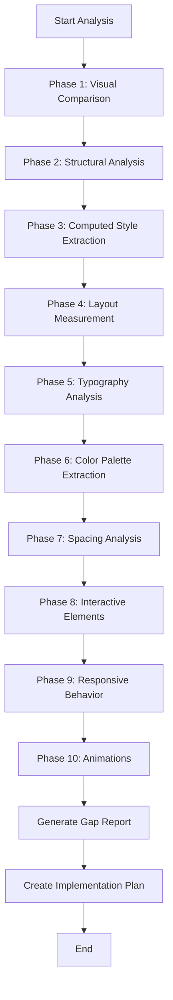

# Mock UI Analysis Methodology

**Version:** 1.0
**Last Updated:** 2025-11-14
**Purpose:** Systematic methodology for comparing live Next.js pages against HTML/CSS mockups using Chrome DevTools MCP

---

## Table of Contents

1. [Overview](#overview)
2. [Tools and Prerequisites](#tools-and-prerequisites)
3. [Analysis Workflow](#analysis-workflow)
4. [Phase 1: Visual Comparison](#phase-1-visual-comparison)
5. [Phase 2: Structural Analysis](#phase-2-structural-analysis)
6. [Phase 3: Computed Style Extraction](#phase-3-computed-style-extraction)
7. [Phase 4: Layout Measurement](#phase-4-layout-measurement)
8. [Phase 5: Typography Analysis](#phase-5-typography-analysis)
9. [Phase 6: Color Palette Extraction](#phase-6-color-palette-extraction)
10. [Phase 7: Spacing and Sizing Analysis](#phase-7-spacing-and-sizing-analysis)
11. [Phase 8: Interactive Elements](#phase-8-interactive-elements)
12. [Phase 9: Responsive Behavior](#phase-9-responsive-behavior)
13. [Phase 10: Animation and Transitions](#phase-10-animation-and-transitions)
14. [Gap Analysis Framework](#gap-analysis-framework)
15. [Reporting Template](#reporting-template)
16. [Best Practices](#best-practices)
17. [Common Pitfalls](#common-pitfalls)
18. [Appendix: DevTools Scripts](#appendix-devtools-scripts)

---

## Overview

### Purpose

This document defines a **rigorous, repeatable methodology** for analyzing differences between:

- **Live Implementation:** Next.js pages running on `localhost:3000`
- **Mock UI Reference:** HTML/CSS mockups in `reference/redesign/` directory

### Goals

1. **Consistency:** Ensure all pages follow the same design system
2. **Precision:** Use computed styles rather than visual estimation
3. **Completeness:** Capture all aspects (layout, colors, typography, interactions)
4. **Actionability:** Generate clear, implementable gap reports
5. **Traceability:** Document exact numerical differences for validation

### Scope

This methodology covers:

- Layout structure and positioning
- Visual design (colors, shadows, borders, backgrounds)
- Typography (fonts, sizes, weights, line heights)
- Spacing (margins, padding, gaps)
- Interactive states (hover, focus, active, disabled)
- Responsive breakpoints and behavior
- Animations and transitions
- Accessibility tree structure

---

## Tools and Prerequisites

### Required Tools

1. **Chrome DevTools MCP Server**
   - Tool: `mcp__chrome-devtools__*`
   - Capabilities: Navigation, screenshots, snapshots, script evaluation

2. **Browser Setup**
   - Chrome/Chromium with DevTools protocol
   - Window size: 1920x1080 (desktop), 375x667 (mobile), 768x1024 (tablet)

3. **Reference Files**
   - Mock UI HTML files in `reference/redesign/`
   - Screenshot comparison capability
   - File read access for HTML/CSS inspection

### Environment Verification

Before starting analysis:

```bash
# Verify dev server is running
curl http://localhost:3000

# Verify mockup files exist
ls reference/redesign/*.html

# Verify Chrome DevTools MCP is available
# (check mcp__chrome-devtools__list_pages is callable)
```

---

## Analysis Workflow

### Complete Analysis Sequence



### Time Estimates

| Phase                     | Estimated Time | Output                     |
| ------------------------- | -------------- | -------------------------- |
| Visual Comparison         | 5-10 min       | Screenshots, visual notes  |
| Structural Analysis       | 10-15 min      | DOM tree comparison        |
| Computed Style Extraction | 15-20 min      | CSS property tables        |
| Layout Measurement        | 10-15 min      | Dimension matrices         |
| Typography Analysis       | 10-15 min      | Font specification table   |
| Color Palette Extraction  | 10-15 min      | Color usage matrix         |
| Spacing Analysis          | 15-20 min      | Spacing scale verification |
| Interactive Elements      | 15-20 min      | State comparison tables    |
| Responsive Behavior       | 20-30 min      | Breakpoint analysis        |
| Animations                | 10-15 min      | Transition specifications  |
| **Total**                 | **2-3 hours**  | **Complete gap report**    |

---

## Phase 1: Visual Comparison

### Objective

Establish baseline visual differences through side-by-side screenshot comparison.

### Steps

#### 1.1 Navigate to Live Page

```javascript
// Use DevTools MCP
mcp__chrome -
  devtools__navigate_page({
    type: 'url',
    url: 'http://localhost:3000/target-page',
  })
```

#### 1.2 Capture Full-Page Screenshots

```javascript
// Live implementation
mcp__chrome -
  devtools__take_screenshot({
    fullPage: true,
    format: 'png',
  })
// Save as: screenshots/live_[page-name]_[timestamp].png

// Open mockup in new tab
mcp__chrome -
  devtools__new_page({
    url: 'file:///absolute/path/to/reference/redesign/mockup.html',
  })

// Mockup reference
mcp__chrome -
  devtools__take_screenshot({
    fullPage: true,
    format: 'png',
  })
// Save as: screenshots/mockup_[page-name]_[timestamp].png
```

#### 1.3 Visual Inventory Checklist

Document presence/absence of major UI elements:

```markdown
## Visual Element Inventory

### Header

- [ ] Logo/brand
- [ ] Navigation menu
- [ ] Search bar
- [ ] User actions
- [ ] Breadcrumbs

### Main Content

- [ ] Page title
- [ ] Primary content area
- [ ] Sidebar (if applicable)
- [ ] Cards/panels
- [ ] Data tables
- [ ] Forms

### Footer

- [ ] Footer content
- [ ] Copyright/legal
- [ ] Links

### Overall

- [ ] Background treatment
- [ ] Shadows/depth
- [ ] Icons
- [ ] Badges/tags
- [ ] Buttons
- [ ] Loading states
```

#### 1.4 High-Level Differences

Document obvious visual gaps:

```markdown
## Major Visual Differences

1. **Layout Structure**
   - Live: [description]
   - Mockup: [description]
   - Gap: [specific difference]

2. **Color Scheme**
   - Live: [primary colors observed]
   - Mockup: [primary colors observed]
   - Gap: [differences]

3. **Visual Hierarchy**
   - Live: [hierarchy assessment]
   - Mockup: [hierarchy assessment]
   - Gap: [differences]
```

---

## Phase 2: Structural Analysis

### Objective

Compare DOM structure and accessibility tree between live and mockup.

### Steps

#### 2.1 Extract Accessibility Tree

```javascript
// Live page
mcp__chrome -
  devtools__take_snapshot({
    verbose: true,
  })
// Save output to: analysis/live_a11y_tree.txt

// Mockup page
mcp__chrome -
  devtools__take_snapshot({
    verbose: true,
  })
// Save output to: analysis/mockup_a11y_tree.txt
```

#### 2.2 Extract DOM Structure

Use `evaluate_script` to get detailed DOM structure:

```javascript
mcp__chrome -
  devtools__evaluate_script({
    function: `() => {
    function serializeDOM(element, depth = 0) {
      const indent = '  '.repeat(depth);
      let result = indent + element.tagName.toLowerCase();

      // Add significant attributes
      if (element.id) result += '#' + element.id;
      if (element.className) result += '.' + element.className.split(' ').join('.');

      // Add role if present
      if (element.getAttribute('role')) result += '[role=' + element.getAttribute('role') + ']';

      result += '\\n';

      // Recurse for children (limit depth to avoid overwhelming output)
      if (depth < 8) {
        for (let child of element.children) {
          result += serializeDOM(child, depth + 1);
        }
      }

      return result;
    }

    return serializeDOM(document.body);
  }`,
  })
```

#### 2.3 Compare Component Structure

Create side-by-side comparison:

```markdown
## Component Structure Comparison

| Component      | Live Implementation           | Mockup Reference              | Match? |
| -------------- | ----------------------------- | ----------------------------- | ------ |
| Header         | `<header class="app-header">` | `<header class="app-header">` | ✓      |
| Main Content   | `<div class="container">`     | `<main class="main-content">` | ✗      |
| Sidebar        | Missing                       | `<aside class="sidebar">`     | ✗      |
| Card Container | `<div>`                       | `<div class="card">`          | ✗      |

### Structural Gaps

1. **Missing semantic elements**
   - Live uses `<div>` where mockup uses `<main>`
   - No `<aside>` for sidebar in live

2. **Class naming inconsistencies**
   - Live: `container`, Mockup: `main-content`
   - Live: generic `<div>`, Mockup: `.card`

3. **Component hierarchy differences**
   - [Describe nesting differences]
```

#### 2.4 Extract ARIA and Semantic Attributes

```javascript
mcp__chrome -
  devtools__evaluate_script({
    function: `() => {
    const elements = document.querySelectorAll('[role], [aria-label], [aria-labelledby], [aria-describedby]');
    return Array.from(elements).map(el => ({
      tag: el.tagName.toLowerCase(),
      id: el.id,
      class: el.className,
      role: el.getAttribute('role'),
      ariaLabel: el.getAttribute('aria-label'),
      ariaLabelledBy: el.getAttribute('aria-labelledby'),
      ariaDescribedBy: el.getAttribute('aria-describedby')
    }));
  }`,
  })
```

---

## Phase 3: Computed Style Extraction

### Objective

Extract actual computed CSS values for all major elements.

### Steps

#### 3.1 Identify Key Elements

Create a selector map for comparison:

```javascript
const keySelectors = {
  'Page Container': 'main',
  Header: 'header',
  'Customer Header': '.customer-header',
  'Customer Avatar': '.customer-avatar-large',
  'Customer Name': '.customer-name',
  'Status Badge': '.status-badge',
  'Meta Grid': '.customer-meta',
  Card: '.card',
  'Card Header': '.card-header',
  'Card Title': '.card-title',
  'Form Grid': '.form-grid',
  'Form Input': '.form-input',
  'Button Primary': '.btn-primary',
  'Button Secondary': '.btn-secondary',
  Sidebar: '.sidebar-column',
}
```

#### 3.2 Extract Computed Styles

For each selector, extract comprehensive style data:

```javascript
mcp__chrome -
  devtools__evaluate_script({
    function: `() => {
    const selectors = {
      'Page Container': 'main',
      'Header': 'header',
      'Card': '.card',
      'Button': '.btn-primary'
      // ... all key selectors
    };

    const results = {};

    for (let [name, selector] of Object.entries(selectors)) {
      const element = document.querySelector(selector);
      if (!element) {
        results[name] = { error: 'Element not found' };
        continue;
      }

      const computed = window.getComputedStyle(element);

      results[name] = {
        // Layout
        display: computed.display,
        position: computed.position,
        width: computed.width,
        height: computed.height,

        // Box Model
        margin: computed.margin,
        marginTop: computed.marginTop,
        marginRight: computed.marginRight,
        marginBottom: computed.marginBottom,
        marginLeft: computed.marginLeft,
        padding: computed.padding,
        paddingTop: computed.paddingTop,
        paddingRight: computed.paddingRight,
        paddingBottom: computed.paddingBottom,
        paddingLeft: computed.paddingLeft,

        // Border
        border: computed.border,
        borderWidth: computed.borderWidth,
        borderStyle: computed.borderStyle,
        borderColor: computed.borderColor,
        borderRadius: computed.borderRadius,

        // Background
        backgroundColor: computed.backgroundColor,
        backgroundImage: computed.backgroundImage,

        // Typography
        fontFamily: computed.fontFamily,
        fontSize: computed.fontSize,
        fontWeight: computed.fontWeight,
        lineHeight: computed.lineHeight,
        letterSpacing: computed.letterSpacing,
        color: computed.color,
        textAlign: computed.textAlign,
        textTransform: computed.textTransform,

        // Visual Effects
        boxShadow: computed.boxShadow,
        opacity: computed.opacity,
        transform: computed.transform,

        // Flexbox/Grid (if applicable)
        flexDirection: computed.flexDirection,
        justifyContent: computed.justifyContent,
        alignItems: computed.alignItems,
        gap: computed.gap,
        gridTemplateColumns: computed.gridTemplateColumns,
        gridTemplateRows: computed.gridTemplateRows,
        gridGap: computed.gridGap
      };
    }

    return results;
  }`,
  })
```

#### 3.3 Create Style Comparison Tables

Document in structured format:

```markdown
## Computed Style Comparison: .card

| Property           | Live Value         | Mockup Value                 | Match? | Notes                                       |
| ------------------ | ------------------ | ---------------------------- | ------ | ------------------------------------------- |
| **Layout**         |
| display            | block              | block                        | ✓      |                                             |
| position           | static             | relative                     | ✗      | Mockup needs position for absolute children |
| **Box Model**      |
| padding            | 16px               | 24px                         | ✗      | Live uses smaller padding                   |
| margin-bottom      | 0px                | 24px                         | ✗      | Live has no vertical spacing                |
| **Border**         |
| border             | 1px solid #e5e7eb  | 1px solid #e2e8f0            | ✗      | Different gray shades                       |
| border-radius      | 8px                | 16px                         | ✗      | Mockup uses larger radius                   |
| **Background**     |
| background-color   | rgb(255, 255, 255) | rgb(255, 255, 255)           | ✓      |                                             |
| **Visual Effects** |
| box-shadow         | none               | 0 1px 2px 0 rgba(0,0,0,0.05) | ✗      | Live missing shadow                         |
```

#### 3.4 Automate Batch Extraction

Create reusable script for all elements:

```javascript
mcp__chrome -
  devtools__evaluate_script({
    function: `() => {
    const propertiesToExtract = [
      'display', 'position', 'width', 'height',
      'marginTop', 'marginRight', 'marginBottom', 'marginLeft',
      'paddingTop', 'paddingRight', 'paddingBottom', 'paddingLeft',
      'borderWidth', 'borderStyle', 'borderColor', 'borderRadius',
      'backgroundColor', 'backgroundImage',
      'fontFamily', 'fontSize', 'fontWeight', 'lineHeight', 'color',
      'boxShadow', 'opacity', 'transform',
      'flexDirection', 'justifyContent', 'alignItems', 'gap',
      'gridTemplateColumns', 'gridGap'
    ];

    const allElements = document.querySelectorAll('*');
    const elementData = [];

    for (let element of allElements) {
      // Skip if no class or id (too generic)
      if (!element.id && !element.className) continue;

      const computed = window.getComputedStyle(element);
      const data = {
        selector: element.id ? '#' + element.id : '.' + element.className.split(' ')[0],
        tag: element.tagName.toLowerCase(),
        styles: {}
      };

      for (let prop of propertiesToExtract) {
        data.styles[prop] = computed[prop];
      }

      elementData.push(data);
    }

    return elementData;
  }`,
  })
```

---

## Phase 4: Layout Measurement

### Objective

Precisely measure layout dimensions, positioning, and spacing.

### Steps

#### 4.1 Extract Bounding Boxes

Get pixel-perfect measurements:

```javascript
mcp__chrome -
  devtools__evaluate_script({
    function: `() => {
    const selectors = [
      'main',
      '.customer-header',
      '.content-grid',
      '.main-column',
      '.sidebar-column',
      '.card',
      '.form-grid',
      '.animal-card'
      // ... all key layout elements
    ];

    const measurements = {};

    for (let selector of selectors) {
      const element = document.querySelector(selector);
      if (!element) {
        measurements[selector] = { error: 'Not found' };
        continue;
      }

      const rect = element.getBoundingClientRect();
      const computed = window.getComputedStyle(element);

      measurements[selector] = {
        // Bounding box
        x: rect.x,
        y: rect.y,
        width: rect.width,
        height: rect.height,
        top: rect.top,
        right: rect.right,
        bottom: rect.bottom,
        left: rect.left,

        // Computed dimensions
        computedWidth: computed.width,
        computedHeight: computed.height,

        // Box model breakdown
        contentWidth: parseFloat(computed.width) -
                      parseFloat(computed.paddingLeft) -
                      parseFloat(computed.paddingRight),
        contentHeight: parseFloat(computed.height) -
                       parseFloat(computed.paddingTop) -
                       parseFloat(computed.paddingBottom),

        // Position in viewport
        offsetTop: element.offsetTop,
        offsetLeft: element.offsetLeft
      };
    }

    return measurements;
  }`,
  })
```

#### 4.2 Grid Layout Analysis

For grid containers, extract grid specifications:

```javascript
mcp__chrome -
  devtools__evaluate_script({
    function: `() => {
    const grids = document.querySelectorAll('[style*="grid"], .grid, [class*="grid"]');
    const gridData = [];

    for (let grid of grids) {
      const computed = window.getComputedStyle(grid);

      if (computed.display !== 'grid') continue;

      gridData.push({
        selector: grid.className || grid.id || grid.tagName,
        gridTemplateColumns: computed.gridTemplateColumns,
        gridTemplateRows: computed.gridTemplateRows,
        gridColumnGap: computed.gridColumnGap,
        gridRowGap: computed.gridRowGap,
        gridGap: computed.gridGap,
        gridAutoFlow: computed.gridAutoFlow,
        justifyContent: computed.justifyContent,
        alignItems: computed.alignItems,

        // Count children
        childCount: grid.children.length
      });
    }

    return gridData;
  }`,
  })
```

#### 4.3 Flexbox Layout Analysis

For flex containers:

```javascript
mcp__chrome -
  devtools__evaluate_script({
    function: `() => {
    const flexContainers = Array.from(document.querySelectorAll('*')).filter(el => {
      return window.getComputedStyle(el).display === 'flex';
    });

    return flexContainers.map(el => {
      const computed = window.getComputedStyle(el);
      return {
        selector: el.className || el.id || el.tagName,
        flexDirection: computed.flexDirection,
        flexWrap: computed.flexWrap,
        justifyContent: computed.justifyContent,
        alignItems: computed.alignItems,
        alignContent: computed.alignContent,
        gap: computed.gap,
        childCount: el.children.length
      };
    });
  }`,
  })
```

#### 4.4 Create Layout Matrix

```markdown
## Layout Measurement Matrix

### .content-grid (Two-Column Layout)

| Property                  | Live  | Mockup      | Gap             | Priority |
| ------------------------- | ----- | ----------- | --------------- | -------- |
| **Display**               | block | grid        | Missing grid    | HIGH     |
| **Grid Template Columns** | N/A   | 1fr 400px   | Not implemented | HIGH     |
| **Gap**                   | 0px   | 32px (2rem) | No spacing      | HIGH     |
| **Width**                 | 100%  | 100%        | ✓               | -        |

### .sidebar-column

| Property     | Live | Mockup | Gap                   | Priority |
| ------------ | ---- | ------ | --------------------- | -------- |
| **Exists**   | ✗    | ✓      | Entire column missing | CRITICAL |
| **Width**    | -    | 400px  | -                     | HIGH     |
| **Position** | -    | static | -                     | LOW      |

### .card

| Property          | Live  | Mockup | Gap                      | Priority |
| ----------------- | ----- | ------ | ------------------------ | -------- |
| **Width**         | 560px | 100%   | Should fill container    | MEDIUM   |
| **Height**        | 320px | auto   | Should fit content       | LOW      |
| **Margin Bottom** | 0px   | 24px   | No spacing between cards | HIGH     |
```

---

## Phase 5: Typography Analysis

### Objective

Extract complete typography specifications for consistency.

### Steps

#### 5.1 Extract Font Properties

```javascript
mcp__chrome -
  devtools__evaluate_script({
    function: `() => {
    const textElements = document.querySelectorAll('h1, h2, h3, h4, h5, h6, p, span, a, button, input, label');
    const typography = {};

    for (let el of textElements) {
      const computed = window.getComputedStyle(el);
      const selector = el.tagName.toLowerCase() +
                      (el.className ? '.' + el.className.split(' ')[0] : '');

      // Group by selector to avoid duplicates
      if (!typography[selector]) {
        typography[selector] = {
          fontFamily: computed.fontFamily,
          fontSize: computed.fontSize,
          fontWeight: computed.fontWeight,
          lineHeight: computed.lineHeight,
          letterSpacing: computed.letterSpacing,
          textTransform: computed.textTransform,
          color: computed.color,
          textAlign: computed.textAlign,

          // Additional useful properties
          fontStyle: computed.fontStyle,
          textDecoration: computed.textDecoration,
          whiteSpace: computed.whiteSpace,
          wordBreak: computed.wordBreak
        };
      }
    }

    return typography;
  }`,
  })
```

#### 5.2 Create Typography Scale Table

```markdown
## Typography Comparison

| Element           | Property       | Live    | Mockup          | Match? | Notes                |
| ----------------- | -------------- | ------- | --------------- | ------ | -------------------- |
| **h1**            | font-size      | 24px    | 40px (2.5rem)   | ✗      | Live too small       |
|                   | font-weight    | 700     | 800             | ✗      | Live not bold enough |
|                   | line-height    | 32px    | 48px            | ✗      |                      |
|                   | color          | #1f2937 | #0f172a         | ✗      | Different gray       |
| **h2.card-title** | font-size      | 16px    | 18px (1.125rem) | ✗      | Slightly too small   |
|                   | font-weight    | 600     | 700             | ✗      |                      |
|                   | color          | #374151 | #111827         | ✗      |                      |
| **p, body**       | font-size      | 14px    | 16px (1rem)     | ✗      | Base too small       |
|                   | font-weight    | 400     | 400             | ✓      |                      |
|                   | line-height    | 20px    | 25.6px (1.6)    | ✗      |                      |
|                   | color          | #6b7280 | #1e293b         | ✗      |                      |
| **.meta-label**   | font-size      | 12px    | 12px (0.75rem)  | ✓      |                      |
|                   | font-weight    | 400     | 600             | ✗      | Should be semibold   |
|                   | text-transform | none    | uppercase       | ✗      | Missing uppercase    |
|                   | letter-spacing | normal  | 0.1em           | ✗      | Missing tracking     |
```

#### 5.3 Font Family Verification

```javascript
mcp__chrome -
  devtools__evaluate_script({
    function: `() => {
    const body = document.querySelector('body');
    const computed = window.getComputedStyle(body);

    return {
      declared: computed.fontFamily,
      // Check if custom font loaded
      customFontsLoaded: document.fonts.size,
      fonts: Array.from(document.fonts).map(f => ({
        family: f.family,
        style: f.style,
        weight: f.weight,
        status: f.status
      }))
    };
  }`,
  })
```

---

## Phase 6: Color Palette Extraction

### Objective

Extract complete color palette and verify consistency with design system.

### Steps

#### 6.1 Extract All Colors Used

```javascript
mcp__chrome -
  devtools__evaluate_script({
    function: `() => {
    const allElements = document.querySelectorAll('*');
    const colors = new Set();

    for (let el of allElements) {
      const computed = window.getComputedStyle(el);

      // Text colors
      if (computed.color && computed.color !== 'rgba(0, 0, 0, 0)') {
        colors.add(computed.color);
      }

      // Background colors
      if (computed.backgroundColor && computed.backgroundColor !== 'rgba(0, 0, 0, 0)') {
        colors.add(computed.backgroundColor);
      }

      // Border colors
      if (computed.borderColor && computed.borderColor !== 'rgba(0, 0, 0, 0)') {
        colors.add(computed.borderColor);
      }
    }

    return Array.from(colors).sort();
  }`,
  })
```

#### 6.2 Extract CSS Custom Properties

```javascript
mcp__chrome -
  devtools__evaluate_script({
    function: `() => {
    const root = document.documentElement;
    const styles = window.getComputedStyle(root);
    const customProps = {};

    // Get all custom properties
    for (let prop of styles) {
      if (prop.startsWith('--')) {
        customProps[prop] = styles.getPropertyValue(prop).trim();
      }
    }

    return customProps;
  }`,
  })
```

#### 6.3 Create Color Palette Comparison

```markdown
## Color Palette Analysis

### Primary Colors

| Variable        | Live Value | Mockup Value | Match? | Usage                   |
| --------------- | ---------- | ------------ | ------ | ----------------------- |
| --primary       | #6366f1    | #6366f1      | ✓      | Buttons, links, accents |
| --primary-hover | #4f46e5    | #4f46e5      | ✓      | Button hover states     |
| --primary-light | #e0e7ff    | #e0e7ff      | ✓      | Backgrounds, badges     |
| --secondary     | #06b6d4    | #06b6d4      | ✓      | Secondary actions       |
| --success       | #10b981    | #10b981      | ✓      | Success states          |
| --warning       | #f59e0b    | #f59e0b      | ✓      | Warning states          |
| --error         | #ef4444    | #ef4444      | ✓      | Error states            |

### Neutral Colors

| Variable   | Live Value  | Mockup Value | Match? |
| ---------- | ----------- | ------------ | ------ |
| --gray-50  | Not defined | #f8fafc      | ✗      |
| --gray-100 | Not defined | #f1f5f9      | ✗      |
| --gray-200 | #e5e7eb     | #e2e8f0      | ✗      |
| --gray-300 | Not defined | #cbd5e1      | ✗      |
| --gray-500 | #6b7280     | #64748b      | ✗      |
| --gray-700 | #374151     | #334155      | ✗      |
| --gray-800 | #1f2937     | #1e293b      | ✗      |
| --gray-900 | #111827     | #0f172a      | ✗      |

### Color Usage Matrix

| Element     | Property     | Current Color | Expected Color       | Notes           |
| ----------- | ------------ | ------------- | -------------------- | --------------- |
| Body text   | color        | #6b7280       | #1e293b (--gray-800) | Too light       |
| Card border | border-color | #e5e7eb       | #e2e8f0 (--gray-200) | Wrong gray      |
| Heading     | color        | #1f2937       | #0f172a (--gray-900) | Not dark enough |
```

#### 6.4 Detect Color Inconsistencies

```javascript
mcp__chrome -
  devtools__evaluate_script({
    function: `() => {
    const allElements = document.querySelectorAll('*');
    const colorUsage = {};

    for (let el of allElements) {
      const computed = window.getComputedStyle(el);
      const selector = el.className || el.tagName;

      // Track where each color is used
      [computed.color, computed.backgroundColor, computed.borderColor].forEach(color => {
        if (color && color !== 'rgba(0, 0, 0, 0)') {
          if (!colorUsage[color]) colorUsage[color] = [];
          colorUsage[color].push(selector);
        }
      });
    }

    // Find colors used only once (potential inconsistencies)
    const singleUseColors = Object.entries(colorUsage)
      .filter(([color, uses]) => uses.length === 1)
      .map(([color, uses]) => ({ color, usedIn: uses[0] }));

    return {
      totalColors: Object.keys(colorUsage).length,
      singleUseColors: singleUseColors,
      mostUsedColors: Object.entries(colorUsage)
        .sort((a, b) => b[1].length - a[1].length)
        .slice(0, 10)
        .map(([color, uses]) => ({ color, count: uses.length }))
    };
  }`,
  })
```

---

## Phase 7: Spacing and Sizing Analysis

### Objective

Verify spacing scale consistency and extract precise measurements.

### Steps

#### 7.1 Extract Spacing Scale

```javascript
mcp__chrome -
  devtools__evaluate_script({
    function: `() => {
    const root = document.documentElement;
    const styles = window.getComputedStyle(root);
    const spacingVars = {};

    // Extract spacing custom properties
    for (let i = 0; i < styles.length; i++) {
      const prop = styles[i];
      if (prop.startsWith('--space-')) {
        spacingVars[prop] = styles.getPropertyValue(prop).trim();
      }
    }

    return spacingVars;
  }`,
  })
```

#### 7.2 Measure Element Spacing

```javascript
mcp__chrome -
  devtools__evaluate_script({
    function: `() => {
    const elements = document.querySelectorAll('.card, .btn, .form-group, .customer-header, .animal-card');
    const spacingData = [];

    for (let el of elements) {
      const computed = window.getComputedStyle(el);

      spacingData.push({
        selector: el.className || el.tagName,
        margin: {
          top: computed.marginTop,
          right: computed.marginRight,
          bottom: computed.marginBottom,
          left: computed.marginLeft
        },
        padding: {
          top: computed.paddingTop,
          right: computed.paddingRight,
          bottom: computed.paddingBottom,
          left: computed.paddingLeft
        },
        gap: computed.gap
      });
    }

    return spacingData;
  }`,
  })
```

#### 7.3 Create Spacing Audit Table

```markdown
## Spacing Scale Verification

### Spacing Variables

| Variable   | Live Value  | Mockup Value   | Match? |
| ---------- | ----------- | -------------- | ------ |
| --space-1  | Not defined | 0.25rem (4px)  | ✗      |
| --space-2  | Not defined | 0.5rem (8px)   | ✗      |
| --space-3  | Not defined | 0.75rem (12px) | ✗      |
| --space-4  | Not defined | 1rem (16px)    | ✗      |
| --space-5  | Not defined | 1.25rem (20px) | ✗      |
| --space-6  | Not defined | 1.5rem (24px)  | ✗      |
| --space-8  | Not defined | 2rem (32px)    | ✗      |
| --space-10 | Not defined | 2.5rem (40px)  | ✗      |
| --space-12 | Not defined | 3rem (48px)    | ✗      |
| --space-16 | Not defined | 4rem (64px)    | ✗      |

### Element Spacing Analysis

| Element          | Property      | Live     | Mockup    | Gap     | Uses Variable?                 |
| ---------------- | ------------- | -------- | --------- | ------- | ------------------------------ |
| .card            | padding       | 16px     | 24px      | -8px    | Should use --space-6           |
| .card            | margin-bottom | 0px      | 24px      | -24px   | Should use --space-6           |
| .customer-header | margin-bottom | 16px     | 32px      | -16px   | Should use --space-8           |
| .form-grid       | gap           | 12px     | 16px      | -4px    | Should use --space-4           |
| .btn             | padding       | 8px 16px | 12px 20px | Smaller | Should use --space-3 --space-5 |

### Spacing Consistency Issues

- Live implementation uses arbitrary pixel values
- No spacing scale variables defined
- Inconsistent spacing between similar elements
```

---

## Phase 8: Interactive Elements

### Objective

Document interactive states (hover, focus, active, disabled) and behaviors.

### Steps

#### 8.1 Extract Button States

```javascript
mcp__chrome -
  devtools__evaluate_script({
    function: `() => {
    const buttons = document.querySelectorAll('button, .btn, [role="button"]');
    const buttonStates = [];

    for (let btn of buttons) {
      const normal = window.getComputedStyle(btn);

      // Simulate hover (if pseudo-class can be read)
      const data = {
        selector: btn.className || btn.tagName,
        normal: {
          backgroundColor: normal.backgroundColor,
          color: normal.color,
          borderColor: normal.borderColor,
          boxShadow: normal.boxShadow,
          transform: normal.transform,
          cursor: normal.cursor
        }
      };

      buttonStates.push(data);
    }

    return buttonStates;
  }`,
  })
```

#### 8.2 Test Interactive States Manually

For hover/focus states, use DevTools to manually trigger:

```javascript
// Hover state
mcp__chrome - devtools__hover({ uid: 'button_uid' })
mcp__chrome - devtools__take_screenshot()

// Click state (active)
mcp__chrome - devtools__click({ uid: 'button_uid' })
mcp__chrome - devtools__take_screenshot()
```

#### 8.3 Extract Transition Properties

```javascript
mcp__chrome -
  devtools__evaluate_script({
    function: `() => {
    const interactiveElements = document.querySelectorAll('button, a, input, .card, .animal-card, .btn');
    const transitions = [];

    for (let el of interactiveElements) {
      const computed = window.getComputedStyle(el);

      transitions.push({
        selector: el.className || el.tagName,
        transition: computed.transition,
        transitionProperty: computed.transitionProperty,
        transitionDuration: computed.transitionDuration,
        transitionTimingFunction: computed.transitionTimingFunction,
        transitionDelay: computed.transitionDelay
      });
    }

    return transitions;
  }`,
  })
```

#### 8.4 Create Interactive States Matrix

```markdown
## Interactive Elements Analysis

### Button States

| Element      | State    | Property         | Live    | Mockup           | Match? |
| ------------ | -------- | ---------------- | ------- | ---------------- | ------ |
| .btn-primary | normal   | background-color | #6366f1 | #6366f1          | ✓      |
|              | normal   | color            | #ffffff | #ffffff          | ✓      |
|              | hover    | background-color | #6366f1 | #4f46e5          | ✗      |
|              | hover    | transform        | none    | translateY(-1px) | ✗      |
|              | hover    | box-shadow       | none    | enhanced         | ✗      |
|              | active   | background-color | #6366f1 | #4338ca          | ✗      |
|              | disabled | opacity          | 1.0     | 0.5              | ✗      |

### Focus States

| Element     | Property     | Live           | Mockup                         | Match? |
| ----------- | ------------ | -------------- | ------------------------------ | ------ |
| input:focus | outline      | 2px solid blue | none                           | ✗      |
| input:focus | border-color | inherit        | #6366f1                        | ✗      |
| input:focus | box-shadow   | none           | 0 0 0 3px rgba(99,102,241,0.1) | ✗      |

### Transitions

| Element            | Property   | Live | Mockup           | Match? |
| ------------------ | ---------- | ---- | ---------------- | ------ |
| .btn               | transition | none | all 0.2s ease    | ✗      |
| .card              | transition | none | all 0.2s ease    | ✗      |
| .animal-card:hover | transform  | none | translateY(-2px) | ✗      |
```

---

## Phase 9: Responsive Behavior

### Objective

Test and document responsive breakpoints and layout changes.

### Steps

#### 9.1 Test at Standard Breakpoints

```javascript
// Desktop (1920x1080)
mcp__chrome - devtools__resize_page({ width: 1920, height: 1080 })
mcp__chrome - devtools__take_screenshot()
// Extract layout measurements at this size

// Tablet (768x1024)
mcp__chrome - devtools__resize_page({ width: 768, height: 1024 })
mcp__chrome - devtools__take_screenshot()
// Extract layout measurements

// Mobile (375x667)
mcp__chrome - devtools__resize_page({ width: 375, height: 667 })
mcp__chrome - devtools__take_screenshot()
// Extract layout measurements
```

#### 9.2 Extract Media Queries

From mockup HTML/CSS:

```javascript
// Read mockup file
const mockupCSS = await Read({ file_path: 'reference/redesign/mockup.html' })

// Extract media queries using regex
const mediaQueries = mockupCSS.match(/@media[^{]+\{[\s\S]+?\}\s*\}/g)
```

#### 9.3 Test Layout Changes at Each Breakpoint

```javascript
mcp__chrome -
  devtools__evaluate_script({
    function: `() => {
    const contentGrid = document.querySelector('.content-grid');
    const sidebar = document.querySelector('.sidebar-column');
    const customerHeader = document.querySelector('.customer-header');

    if (!contentGrid) return { error: 'Elements not found' };

    const gridComputed = window.getComputedStyle(contentGrid);
    const sidebarComputed = sidebar ? window.getComputedStyle(sidebar) : null;
    const headerComputed = customerHeader ? window.getComputedStyle(customerHeader) : null;

    return {
      viewport: {
        width: window.innerWidth,
        height: window.innerHeight
      },
      contentGrid: {
        display: gridComputed.display,
        gridTemplateColumns: gridComputed.gridTemplateColumns,
        gap: gridComputed.gap
      },
      sidebar: sidebarComputed ? {
        display: sidebarComputed.display,
        width: sidebarComputed.width
      } : null,
      customerHeader: headerComputed ? {
        flexDirection: headerComputed.flexDirection,
        textAlign: headerComputed.textAlign
      } : null
    };
  }`,
  })
```

#### 9.4 Create Responsive Behavior Matrix

```markdown
## Responsive Breakpoints Analysis

### Media Query Definitions

| Breakpoint | Live        | Mockup                                 | Match? |
| ---------- | ----------- | -------------------------------------- | ------ |
| Mobile     | Not defined | max-width: 768px                       | ✗      |
| Tablet     | Not defined | min-width: 768px and max-width: 1024px | ✗      |
| Desktop    | Default     | min-width: 1024px                      | ✗      |

### Layout Changes by Breakpoint

#### Desktop (>1024px)

| Element         | Property              | Live | Mockup    | Match? |
| --------------- | --------------------- | ---- | --------- | ------ |
| .content-grid   | grid-template-columns | N/A  | 1fr 400px | ✗      |
| .sidebar-column | display               | N/A  | block     | ✗      |

#### Tablet (768px - 1024px)

| Element         | Property              | Live | Mockup | Match? |
| --------------- | --------------------- | ---- | ------ | ------ |
| .content-grid   | grid-template-columns | N/A  | 1fr    | ✗      |
| .sidebar-column | display               | N/A  | block  | ✗      |

#### Mobile (<768px)

| Element          | Property              | Live | Mockup      | Match? |
| ---------------- | --------------------- | ---- | ----------- | ------ |
| .content-grid    | grid-template-columns | N/A  | 1fr         | ✗      |
| .customer-header | flex-direction        | N/A  | column      | ✗      |
| .customer-header | text-align            | N/A  | center      | ✗      |
| .customer-name   | font-size             | 24px | 32px (2rem) | ✗      |
| .form-grid       | grid-template-columns | N/A  | 1fr         | ✗      |
| .animals-grid    | grid-template-columns | N/A  | 1fr         | ✗      |

### Responsive Issues

1. **No responsive layout changes implemented**
   - Live page maintains desktop layout at all sizes
   - Mockup has specific behavior at 768px and 1024px breakpoints

2. **Missing mobile optimizations**
   - Text sizes don't scale down
   - Grids don't collapse to single column
   - Sidebar doesn't stack below content
```

---

## Phase 10: Animation and Transitions

### Objective

Document animations, keyframes, and transition effects.

### Steps

#### 10.1 Extract Keyframe Animations

From mockup:

```javascript
// Parse mockup CSS for @keyframes
const keyframes = mockupCSS.match(/@keyframes\s+[\w-]+\s*\{[\s\S]+?\}/g)
```

#### 10.2 Test Animation Timing

```javascript
mcp__chrome -
  devtools__evaluate_script({
    function: `() => {
    const animatedElements = document.querySelectorAll('[class*="card"], [class*="animal"]');
    const animations = [];

    for (let el of animatedElements) {
      const computed = window.getComputedStyle(el);

      animations.push({
        selector: el.className,
        animation: computed.animation,
        animationName: computed.animationName,
        animationDuration: computed.animationDuration,
        animationTimingFunction: computed.animationTimingFunction,
        animationDelay: computed.animationDelay,
        animationIterationCount: computed.animationIterationCount
      });
    }

    return animations;
  }`,
  })
```

#### 10.3 Create Animation Specification Table

```markdown
## Animation Analysis

### Keyframe Definitions

| Animation Name | Live        | Mockup  | Match? |
| -------------- | ----------- | ------- | ------ |
| slideInUp      | Not defined | Defined | ✗      |
| gradientShift  | Not defined | Defined | ✗      |

### Mockup Keyframes

#### slideInUp

\`\`\`css
@keyframes slideInUp {
from {
opacity: 0;
transform: translateY(20px);
}
to {
opacity: 1;
transform: translateY(0);
}
}
\`\`\`

### Animation Usage

| Element            | Animation     | Duration | Delay | Timing        | Live | Mockup |
| ------------------ | ------------- | -------- | ----- | ------------- | ---- | ------ |
| .card:nth-child(1) | slideInUp     | 0.4s     | 0s    | ease-out      | ✗    | ✓      |
| .card:nth-child(2) | slideInUp     | 0.4s     | 0.1s  | ease-out      | ✗    | ✓      |
| .card:nth-child(3) | slideInUp     | 0.4s     | 0.2s  | ease-out      | ✗    | ✓      |
| body (background)  | gradientShift | 15s      | 0s    | ease infinite | ✗    | ✓      |

### Transition Effects

| Element         | Event | Property   | Duration | Timing | Live | Mockup    |
| --------------- | ----- | ---------- | -------- | ------ | ---- | --------- |
| .btn            | hover | all        | -        | -      | ✗    | 0.2s ease |
| .card           | hover | box-shadow | -        | -      | ✗    | 0.2s ease |
| .animal-card    | hover | transform  | -        | -      | ✗    | 0.2s ease |
| .contact-action | hover | opacity    | -        | -      | ✗    | 0.2s ease |

### Missing Animations

1. **Card entrance animations** - Cards appear immediately, no staggered slideInUp
2. **Background gradient animation** - Static background, no gradientShift
3. **Hover transitions** - No smooth transitions on interactive elements
4. **Transform effects** - No translateY on hover for cards/buttons
```

---

## Gap Analysis Framework

### Gap Classification

Categorize all identified gaps using this system:

#### Severity Levels

| Level        | Criteria                                  | Impact                          | Examples                                         |
| ------------ | ----------------------------------------- | ------------------------------- | ------------------------------------------------ |
| **CRITICAL** | Missing entire components/features        | Breaks core functionality or UX | Missing sidebar, broken layout                   |
| **HIGH**     | Significant visual/functional differences | Major UX degradation            | Wrong colors, missing spacing, no hover states   |
| **MEDIUM**   | Noticeable but non-blocking differences   | Minor UX impact                 | Slightly different padding, missing icons        |
| **LOW**      | Minor cosmetic differences                | Minimal impact                  | Border radius off by 2px, slight color variation |

#### Priority Matrix

| Severity     | Effort: Low      | Effort: Medium   | Effort: High      |
| ------------ | ---------------- | ---------------- | ----------------- |
| **CRITICAL** | P0 - Immediate   | P0 - Immediate   | P1 - Next Sprint  |
| **HIGH**     | P1 - Next Sprint | P1 - Next Sprint | P2 - Backlog      |
| **MEDIUM**   | P2 - Backlog     | P2 - Backlog     | P3 - Future       |
| **LOW**      | P3 - Future      | P3 - Future      | P4 - Nice-to-have |

### Gap Documentation Template

For each identified gap:

```markdown
## Gap: [Short Description]

**ID:** GAP-[PAGE]-[NUMBER]
**Category:** [Layout | Visual | Typography | Interaction | Data | Performance]
**Severity:** [CRITICAL | HIGH | MEDIUM | LOW]
**Effort:** [Low | Medium | High]
**Priority:** [P0 | P1 | P2 | P3 | P4]

### Current State

[Detailed description with measurements/values]

### Target State

[Detailed description with measurements/values from mockup]

### Specific Differences

- [ ] Difference 1 (with values)
- [ ] Difference 2 (with values)
- [ ] Difference 3 (with values)

### Resolution Steps

1. Step 1
2. Step 2
3. Step 3

### Affected Files

- `path/to/file1.tsx`
- `path/to/file2.css`

### CSS Changes Required

\`\`\`css
/_ Live _/
.selector {
property: current-value;
}

/_ Should be _/
.selector {
property: target-value;
}
\`\`\`

### Component Changes Required

\`\`\`tsx
// Description of React/Next.js changes needed
\`\`\`

### Testing Criteria

- [ ] Visual match at desktop (1920px)
- [ ] Visual match at tablet (768px)
- [ ] Visual match at mobile (375px)
- [ ] Interactive states work correctly
- [ ] Animations play as expected

### Dependencies

- Depends on: [GAP-XXX, GAP-YYY]
- Blocks: [GAP-ZZZ]

### Estimated Time

[Hours]

### Notes

[Any additional context, risks, or considerations]
```

---

## Reporting Template

### Executive Summary Report

Use this template for the final gap analysis document:

```markdown
# [Page Name] - Gap Analysis Report

**Date:** YYYY-MM-DD
**Analyst:** [Name]
**Live URL:** http://localhost:3000/[page]
**Mockup Reference:** reference/redesign/[mockup-file].html
**Completion Percentage:** X%

---

## Executive Summary

[Brief overview of findings]

### Overall Assessment

- **Visual Fidelity:** X/100
- **Functional Completeness:** X/100
- **Design System Adherence:** X/100
- **Responsive Implementation:** X/100
- **Performance:** X/100

### Key Metrics

| Metric                 | Current | Target | Gap |
| ---------------------- | ------- | ------ | --- |
| Components Implemented | X       | Y      | -Z  |
| CSS Properties Matched | X%      | 100%   | -Y% |
| Responsive Breakpoints | X       | Y      | -Z  |
| Interactive States     | X       | Y      | -Z  |
| Animations             | X       | Y      | -Z  |

---

## Visual Comparison

### Screenshots


### Side-by-Side Comparison

[ASCII art or description of layout differences]

---

## Critical Gaps (P0)

### 1. [Gap Title]

[Using gap documentation template above]

### 2. [Gap Title]

[Using gap documentation template above]

---

## High Priority Gaps (P1)

[List all P1 gaps]

---

## Medium Priority Gaps (P2)

[List all P2 gaps]

---

## Low Priority Gaps (P3-P4)

[Summary of lower priority gaps]

---

## Detailed Analysis

### 1. Layout Structure

[Findings from Phase 4]

### 2. Visual Design

[Findings from Phase 3, 6, 7]

### 3. Typography

[Findings from Phase 5]

### 4. Interactive Elements

[Findings from Phase 8]

### 5. Responsive Behavior

[Findings from Phase 9]

### 6. Animations

[Findings from Phase 10]

---

## Implementation Roadmap

### Phase 1: Foundation (Critical - Week 1)

- [ ] Task 1
- [ ] Task 2
- [ ] Task 3

### Phase 2: Core Features (High - Week 2)

- [ ] Task 1
- [ ] Task 2

### Phase 3: Polish (Medium - Week 3)

- [ ] Task 1
- [ ] Task 2

### Phase 4: Final Touches (Low - Week 4)

- [ ] Task 1
- [ ] Task 2

---

## Component Checklist

### New Components Required

- [ ] `ComponentName.tsx` - Description

### Existing Components to Update

- [ ] `ComponentName.tsx` - Changes needed

### CSS Updates Required

- [ ] `globals.css` - Design tokens
- [ ] `component.module.css` - Component styles

---

## Data Requirements

### Additional API Fields Needed

- `field1` - Purpose
- `field2` - Purpose

### Prisma Query Updates

\`\`\`typescript
// Current query
// Updated query needed
\`\`\`

---

## Risk Assessment

### High Risk

- **Risk 1:** Description
  - Mitigation: Solution

### Medium Risk

- **Risk 1:** Description
  - Mitigation: Solution

### Low Risk

- **Risk 1:** Description
  - Mitigation: Solution

---

## Estimated Effort

| Phase         | Hours  | Dependencies  |
| ------------- | ------ | ------------- |
| Foundation    | X      | -             |
| Core Features | X      | Foundation    |
| Polish        | X      | Core Features |
| Testing       | X      | All phases    |
| **Total**     | **XX** |               |

---

## Success Criteria

### Visual Fidelity

- [ ] Layout matches mockup exactly
- [ ] All colors from design system
- [ ] Typography hierarchy correct
- [ ] Spacing scale followed
- [ ] Shadows and effects match

### Functionality

- [ ] All interactive states work
- [ ] Animations play correctly
- [ ] Responsive behavior at all breakpoints
- [ ] Data displays correctly

### Code Quality

- [ ] Component structure clean
- [ ] CSS follows design system
- [ ] No hardcoded values
- [ ] Accessible markup

### Performance

- [ ] No layout shifts
- [ ] Smooth animations (60fps)
- [ ] Fast initial load

---

## Appendix

### A. Complete Style Comparison Tables

[All detailed tables from phases 3-10]

### B. DevTools Scripts Used

[List all scripts with descriptions]

### C. Screenshot Gallery

[All screenshots taken during analysis]

### D. Raw Data Exports

[JSON/CSV exports from DevTools]

---

**Report End**
```

---

## Best Practices

### 1. Systematic Approach

- Always follow phases in order
- Complete each phase before moving to next
- Document findings immediately
- Take screenshots at every step

### 2. Precision Over Estimation

- Use computed styles, not visual estimation
- Extract actual pixel values
- Measure bounding boxes precisely
- Use DevTools scripting for consistency

### 3. Comprehensive Documentation

- Document every gap, no matter how small
- Include exact values (current vs target)
- Provide code examples for fixes
- Link to relevant mockup sections

### 4. Automation Where Possible

- Reuse DevTools scripts across pages
- Save common extraction scripts
- Build reusable comparison functions
- Automate screenshot workflows

### 5. Version Control

- Save all analysis artifacts in git
- Track changes to mockups
- Document analysis date/version
- Keep historical comparisons

### 6. Collaborative Review

- Share findings with team
- Get validation on priorities
- Discuss implementation approaches
- Update report based on feedback

---

## Common Pitfalls

### Pitfall 1: Trusting Visual Appearance

**Problem:** Assuming elements look the same means they are the same

**Example:**

- Two gray colors that look identical visually
- `#6b7280` vs `#64748b` (barely distinguishable)
- But using different colors breaks design system consistency

**Solution:** Always extract computed colors and compare exact values

### Pitfall 2: Ignoring Pseudo-Elements

**Problem:** Not checking `::before` and `::after` pseudo-elements

**Example:**

- Mockup uses `::before` for gradient border on animal cards
- Live implementation missing this entirely
- Visual gap not obvious in static screenshots

**Solution:** Specifically check for pseudo-elements:

```javascript
const before = window.getComputedStyle(element, '::before')
const after = window.getComputedStyle(element, '::after')
```

### Pitfall 3: Missing Hover/Focus States

**Problem:** Only checking default state, missing interactive states

**Example:**

- Buttons look correct in default state
- Hover state does nothing (missing transition)
- Focus state uses browser default (not custom design)

**Solution:** Manually test all interactive states using DevTools hover/focus/active

### Pitfall 4: Viewport-Specific Issues

**Problem:** Only testing at one screen size

**Example:**

- Page looks good at 1920px desktop
- Completely breaks at 768px tablet
- Sidebar overlaps content at mobile size

**Solution:** Test at minimum 3 breakpoints (mobile, tablet, desktop)

### Pitfall 5: Hardcoded vs Variable Values

**Problem:** Not distinguishing between hardcoded values and design system variables

**Example:**

- Live: `padding: 24px` (hardcoded)
- Mockup: `padding: var(--space-6)` (24px from variable)
- Both render the same, but live breaks design system

**Solution:** Check if CSS custom properties are used, not just final computed values

### Pitfall 6: Animation Timing

**Problem:** Checking only if animation exists, not duration/timing/delay

**Example:**

- Both have card entrance animation
- Live: 0.1s (too fast)
- Mockup: 0.4s (smooth)
- Timing difference ruins the effect

**Solution:** Extract complete animation specifications including timing functions

### Pitfall 7: Font Loading

**Problem:** Not verifying if custom fonts loaded successfully

**Example:**

- CSS declares `font-family: 'Inter'`
- Font fails to load, falls back to system font
- Metrics all wrong due to font differences

**Solution:** Check `document.fonts` API for loaded fonts

### Pitfall 8: Z-Index Stacking

**Problem:** Not checking z-index layering and stacking contexts

**Example:**

- Dropdown menu appears behind other content
- Modal backdrop doesn't cover sidebar
- Tooltip clipped by parent overflow

**Solution:** Extract z-index values and test stacking in practice

### Pitfall 9: Overflow Behavior

**Problem:** Not testing content overflow scenarios

**Example:**

- Short customer name looks fine
- Long customer name breaks layout
- Text overflows container instead of wrapping

**Solution:** Test with realistic data including edge cases (long text, missing data)

### Pitfall 10: Sub-Pixel Rendering

**Problem:** Expecting exact pixel-perfect match at all zoom levels

**Example:**

- Element is 24.5px at 100% zoom
- Rounds to 25px at 110% zoom
- Appears as "different" in comparison

**Solution:** Allow tolerance of 0.5-1px for sub-pixel rounding differences

---

## Appendix: DevTools Scripts

### Script 1: Complete Style Extraction

```javascript
/**
 * Extract comprehensive computed styles for a selector
 * Usage: extractStyles('.selector')
 */
function extractStyles(selector) {
  const element = document.querySelector(selector)
  if (!element) return { error: 'Element not found' }

  const computed = window.getComputedStyle(element)
  const before = window.getComputedStyle(element, '::before')
  const after = window.getComputedStyle(element, '::after')

  const properties = [
    // Layout
    'display',
    'position',
    'top',
    'right',
    'bottom',
    'left',
    'width',
    'height',
    'minWidth',
    'minHeight',
    'maxWidth',
    'maxHeight',

    // Box Model
    'margin',
    'marginTop',
    'marginRight',
    'marginBottom',
    'marginLeft',
    'padding',
    'paddingTop',
    'paddingRight',
    'paddingBottom',
    'paddingLeft',

    // Border
    'border',
    'borderWidth',
    'borderStyle',
    'borderColor',
    'borderRadius',
    'borderTopLeftRadius',
    'borderTopRightRadius',
    'borderBottomRightRadius',
    'borderBottomLeftRadius',

    // Background
    'backgroundColor',
    'backgroundImage',
    'backgroundSize',
    'backgroundPosition',
    'backgroundRepeat',

    // Typography
    'fontFamily',
    'fontSize',
    'fontWeight',
    'fontStyle',
    'lineHeight',
    'letterSpacing',
    'textAlign',
    'textTransform',
    'textDecoration',
    'color',

    // Visual Effects
    'boxShadow',
    'opacity',
    'transform',
    'filter',
    'backdropFilter',

    // Flexbox
    'flexDirection',
    'flexWrap',
    'justifyContent',
    'alignItems',
    'alignContent',
    'flex',
    'flexGrow',
    'flexShrink',
    'flexBasis',
    'order',
    'gap',

    // Grid
    'gridTemplateColumns',
    'gridTemplateRows',
    'gridTemplateAreas',
    'gridAutoFlow',
    'gridAutoRows',
    'gridAutoColumns',
    'gridColumnGap',
    'gridRowGap',
    'gridGap',
    'gridColumn',
    'gridRow',

    // Transitions & Animations
    'transition',
    'transitionProperty',
    'transitionDuration',
    'transitionTimingFunction',
    'transitionDelay',
    'animation',
    'animationName',
    'animationDuration',
    'animationTimingFunction',
    'animationDelay',
    'animationIterationCount',
    'animationDirection',

    // Other
    'overflow',
    'overflowX',
    'overflowY',
    'zIndex',
    'cursor',
    'visibility',
    'pointerEvents',
  ]

  const styles = { main: {}, before: {}, after: {} }

  // Extract main element styles
  for (let prop of properties) {
    styles.main[prop] = computed[prop]
  }

  // Extract ::before styles
  if (before.content !== 'none') {
    for (let prop of properties) {
      styles.before[prop] = before[prop]
    }
  }

  // Extract ::after styles
  if (after.content !== 'none') {
    for (let prop of properties) {
      styles.after[prop] = after[prop]
    }
  }

  // Get bounding box
  const rect = element.getBoundingClientRect()
  styles.boundingBox = {
    x: rect.x,
    y: rect.y,
    width: rect.width,
    height: rect.height,
    top: rect.top,
    right: rect.right,
    bottom: rect.bottom,
    left: rect.left,
  }

  return styles
}

// Run it
return extractStyles('.card')
```

### Script 2: Color Palette Extraction

```javascript
/**
 * Extract complete color palette from page
 * Returns sorted unique colors with usage count
 */
function extractColorPalette() {
  const allElements = document.querySelectorAll('*')
  const colorMap = new Map()

  for (let el of allElements) {
    const computed = window.getComputedStyle(el)

    const colors = [
      { type: 'color', value: computed.color },
      { type: 'backgroundColor', value: computed.backgroundColor },
      { type: 'borderColor', value: computed.borderColor },
      { type: 'borderTopColor', value: computed.borderTopColor },
      { type: 'borderRightColor', value: computed.borderRightColor },
      { type: 'borderBottomColor', value: computed.borderBottomColor },
      { type: 'borderLeftColor', value: computed.borderLeftColor },
    ]

    for (let { type, value } of colors) {
      if (value && value !== 'rgba(0, 0, 0, 0)' && value !== 'transparent') {
        const key = value
        if (!colorMap.has(key)) {
          colorMap.set(key, { count: 0, usedIn: [] })
        }
        const data = colorMap.get(key)
        data.count++
        data.usedIn.push({
          tag: el.tagName.toLowerCase(),
          class: el.className,
          type: type,
        })
      }
    }
  }

  // Convert to array and sort by usage
  const palette = Array.from(colorMap.entries())
    .map(([color, data]) => ({
      color,
      count: data.count,
      usedIn: data.usedIn.slice(0, 5), // Sample first 5 usages
    }))
    .sort((a, b) => b.count - a.count)

  return palette
}

return extractColorPalette()
```

### Script 3: Typography Audit

```javascript
/**
 * Complete typography audit
 * Extract all text styles with element context
 */
function typographyAudit() {
  const textElements = document.querySelectorAll(
    'h1, h2, h3, h4, h5, h6, p, span, a, button, label, input, textarea'
  )
  const typographyMap = new Map()

  for (let el of textElements) {
    const computed = window.getComputedStyle(el)
    const key = `${el.tagName.toLowerCase()}.${el.className.split(' ')[0] || 'default'}`

    if (!typographyMap.has(key)) {
      typographyMap.set(key, {
        tag: el.tagName.toLowerCase(),
        class: el.className,
        fontFamily: computed.fontFamily,
        fontSize: computed.fontSize,
        fontWeight: computed.fontWeight,
        fontStyle: computed.fontStyle,
        lineHeight: computed.lineHeight,
        letterSpacing: computed.letterSpacing,
        textTransform: computed.textTransform,
        textDecoration: computed.textDecoration,
        color: computed.color,
        textAlign: computed.textAlign,
        sampleText: el.textContent.slice(0, 50),
        count: 0,
      })
    }

    typographyMap.get(key).count++
  }

  return Array.from(typographyMap.values()).sort((a, b) => b.count - a.count)
}

return typographyAudit()
```

### Script 4: Spacing Audit

```javascript
/**
 * Audit spacing (margin/padding/gap) across all elements
 * Identifies common spacing values for design system
 */
function spacingAudit() {
  const allElements = document.querySelectorAll('*')
  const spacingValues = new Map()

  for (let el of allElements) {
    const computed = window.getComputedStyle(el)

    const spacings = [
      { type: 'marginTop', value: computed.marginTop },
      { type: 'marginRight', value: computed.marginRight },
      { type: 'marginBottom', value: computed.marginBottom },
      { type: 'marginLeft', value: computed.marginLeft },
      { type: 'paddingTop', value: computed.paddingTop },
      { type: 'paddingRight', value: computed.paddingRight },
      { type: 'paddingBottom', value: computed.paddingBottom },
      { type: 'paddingLeft', value: computed.paddingLeft },
      { type: 'gap', value: computed.gap },
    ]

    for (let { type, value } of spacings) {
      if (value && value !== '0px') {
        if (!spacingValues.has(value)) {
          spacingValues.set(value, { count: 0, types: new Set() })
        }
        const data = spacingValues.get(value)
        data.count++
        data.types.add(type)
      }
    }
  }

  // Convert and sort
  const spacingScale = Array.from(spacingValues.entries())
    .map(([value, data]) => ({
      value,
      count: data.count,
      types: Array.from(data.types),
    }))
    .sort((a, b) => {
      // Sort by pixel value
      const aNum = parseFloat(a.value)
      const bNum = parseFloat(b.value)
      return aNum - bNum
    })

  return spacingScale
}

return spacingAudit()
```

### Script 5: Interactive Elements Inventory

```javascript
/**
 * Inventory all interactive elements and their states
 */
function interactiveElementsInventory() {
  const interactive = document.querySelectorAll(
    'button, a, input, select, textarea, [role="button"], [onclick], [tabindex]'
  )
  const inventory = []

  for (let el of interactive) {
    const computed = window.getComputedStyle(el)

    inventory.push({
      tag: el.tagName.toLowerCase(),
      class: el.className,
      id: el.id,
      role: el.getAttribute('role'),
      type: el.type,

      // Style properties
      cursor: computed.cursor,
      pointerEvents: computed.pointerEvents,

      // Transitions
      transition: computed.transition,

      // Accessibility
      tabIndex: el.tabIndex,
      ariaLabel: el.getAttribute('aria-label'),
      disabled: el.disabled,

      // Sample
      text: el.textContent?.slice(0, 30) || el.value?.slice(0, 30) || '',
    })
  }

  return inventory
}

return interactiveElementsInventory()
```

### Script 6: Layout Tree

```javascript
/**
 * Generate visual layout tree showing nesting and display types
 */
function layoutTree(element = document.body, depth = 0) {
  const computed = window.getComputedStyle(element)
  const indent = '  '.repeat(depth)

  let result = indent
  result += element.tagName.toLowerCase()

  if (element.id) result += '#' + element.id
  if (element.className) result += '.' + element.className.split(' ')[0]

  result += ` [${computed.display}]`

  if (computed.display === 'grid') {
    result += ` {${computed.gridTemplateColumns}}`
  } else if (computed.display === 'flex') {
    result += ` {${computed.flexDirection}}`
  }

  result += '\n'

  if (depth < 5) {
    for (let child of element.children) {
      result += layoutTree(child, depth + 1)
    }
  }

  return result
}

return layoutTree()
```

---

## Revision History

| Version | Date       | Changes                      | Author |
| ------- | ---------- | ---------------------------- | ------ |
| 1.0     | 2025-11-14 | Initial methodology document | Claude |

---

**End of Methodology Document**
