# Search Relevance Scoring Documentation

## Table of Contents
1. [Overview](#overview)
2. [Scoring Methodology](#scoring-methodology)
3. [Single-Word Query Scoring](#single-word-query-scoring)
4. [Multi-Word Query Scoring](#multi-word-query-scoring)
5. [Score Ranges](#score-ranges)
6. [Examples with Detailed Breakdowns](#examples-with-detailed-breakdowns)

---

## Overview

The search relevance scoring system determines how well a database record matches a user's search query. The algorithm assigns numerical scores to each result, with higher scores indicating better matches. Results are then sorted by score (descending) to show the most relevant matches first.

### Key Principles

1. **Term-based scoring**: Each word in the query is scored independently
2. **Field-type awareness**: Matches across different field categories (customer name, animal name, breed) receive bonuses
3. **Match quality levels**: Exact matches score higher than partial matches
4. **Additive scoring**: For multi-word queries, scores accumulate across terms

---

## Scoring Methodology

### Match Quality Levels

The algorithm recognizes four levels of match quality:

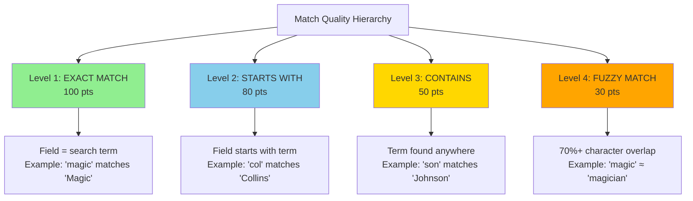

### Searchable Fields

The system searches across **8 fields** organized into **4 categories**:

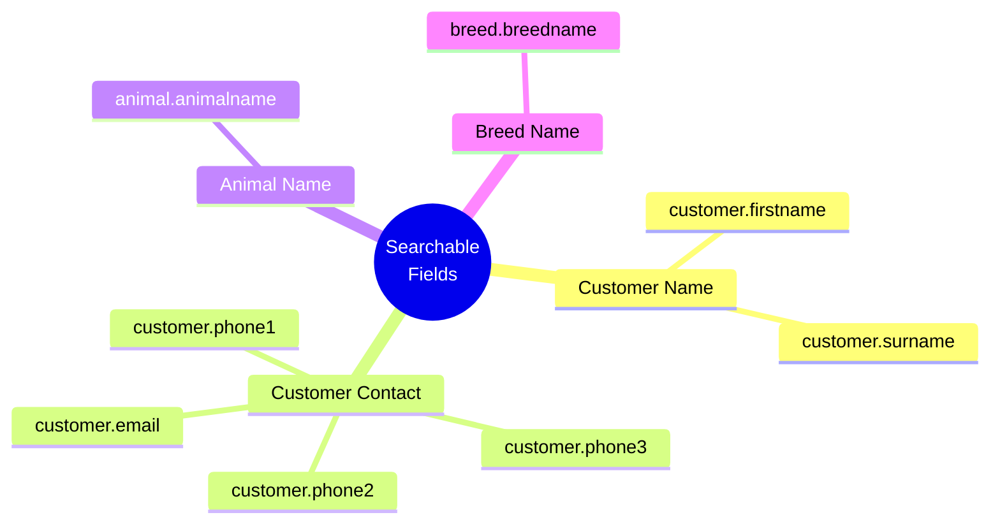

---

## Single-Word Query Scoring

For single-word queries, the algorithm checks the search term against **all 8 fields** and returns the **highest score** found.

### Algorithm Flow

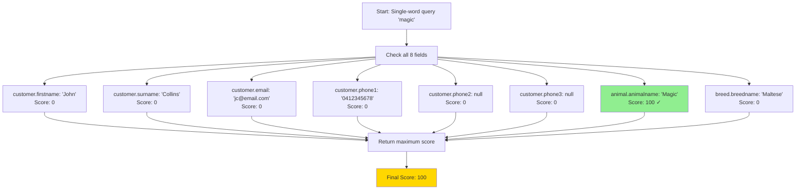

### Example: "col"

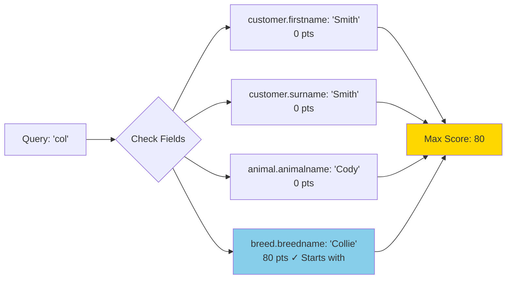

---

## Multi-Word Query Scoring

For multi-word queries, the algorithm uses a **term-by-term additive scoring** approach with a **diversity bonus**.

### Algorithm Flow

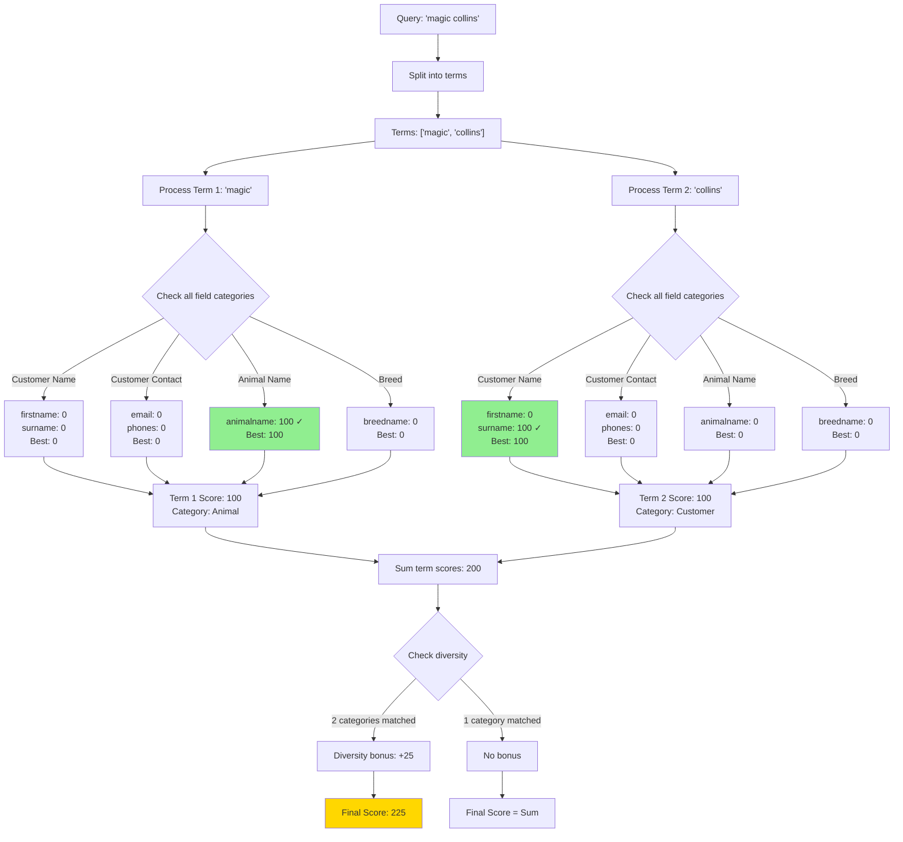

### Why Diversity Bonus?

The diversity bonus rewards queries where terms match **different types** of information:

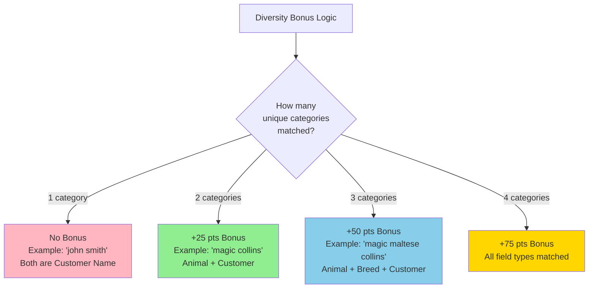

**Example Scenarios:**

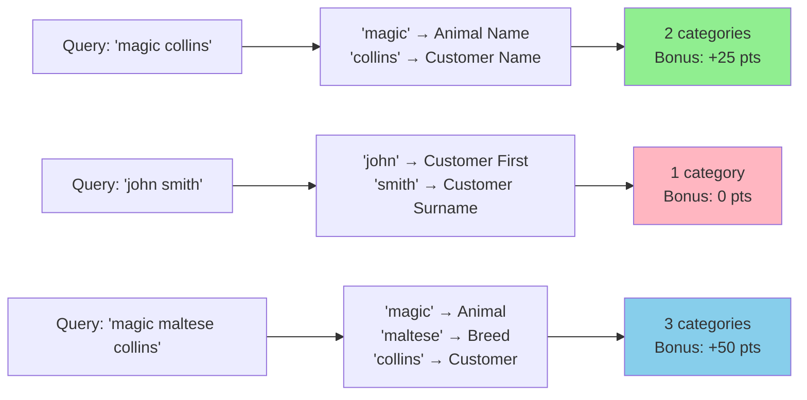

---

## Score Ranges

### Single-Word Queries

| Score Range | Match Type | Description |
|-------------|------------|-------------|
| 100 | Exact | Field exactly equals search term |
| 80 | Starts With | Field begins with search term |
| 50 | Contains | Search term found anywhere in field |
| 30 | Fuzzy | 70%+ character overlap |
| 0 | No Match | No match found in any field |

### Multi-Word Queries

| Score Range | Likely Scenario |
|-------------|-----------------|
| 200+ | Both terms exact/starts-with matches + bonus |
| 150-199 | Both terms matched well, one or both with lower quality |
| 100-149 | One strong match, one weak/no match |
| 60-99 | Both terms weak matches or one term matched only |
| 30-59 | Single weak match |
| 0 | No matches found |

---

## Examples with Detailed Breakdowns

### Example 1: "magic collins" (Correct Record)

**Record:** Animal="Magic", Customer Surname="Collins", Breed="Maltese"

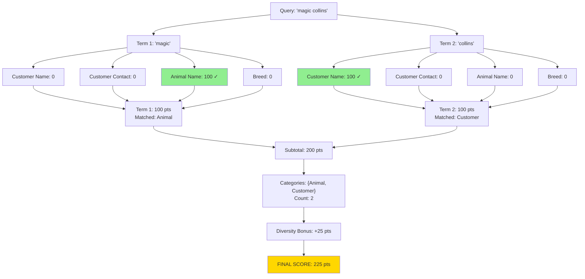

**Scoring Summary:**
- Term 1 "magic": 100 pts (Animal Name - exact match)
- Term 2 "collins": 100 pts (Customer Name - exact match)
- Subtotal: 200 pts
- Diversity bonus: 25 pts (2 categories)
- **FINAL SCORE: 225 pts**

### Example 2: "magic collins" (Wrong Record)

**Record:** Animal="Magic", Customer Surname="Young", Breed="Poodle"

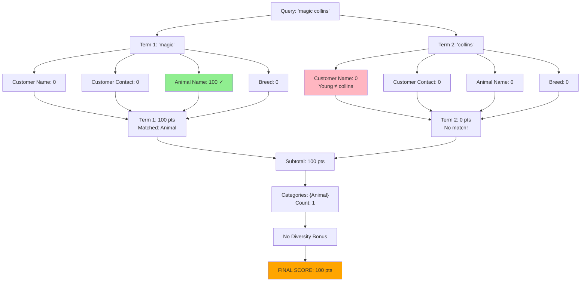

**Scoring Summary:**
- Term 1 "magic": 100 pts (Animal Name - exact match)
- Term 2 "collins": 0 pts (no match)
- Subtotal: 100 pts
- Diversity bonus: 0 pts (only 1 category)
- **FINAL SCORE: 100 pts**

**Result Comparison:**

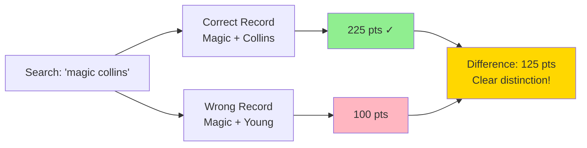

### Example 3: "bobby maltese"

**Comparison of Two Records:**

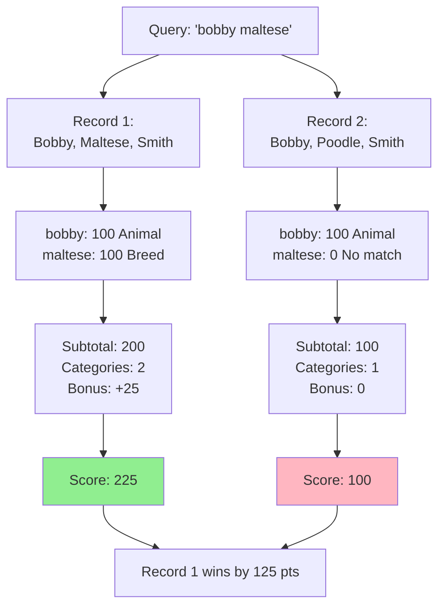

### Example 4: Partial Matches "col"

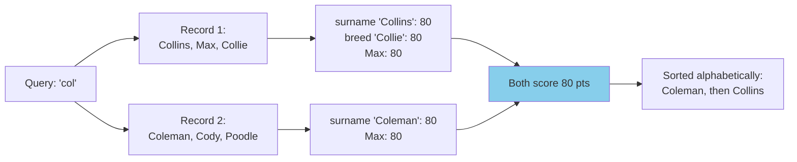

### Example 5: Email Search "joh@gm"

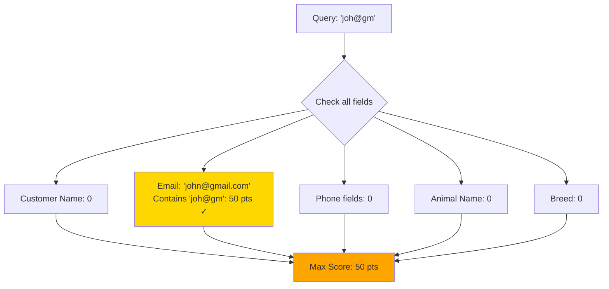

---

## Summary

### Key Takeaways

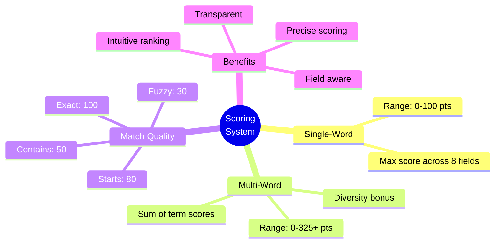

### Algorithm Advantages

✓ **Precise scoring**: Multi-word queries correctly distinguish between partial and complete matches  
✓ **Intuitive ranking**: Better matches always score higher  
✓ **Field awareness**: Recognizes different types of information  
✓ **Scalable**: Performance remains consistent with additional search terms  
✓ **Transparent**: Scores displayed to users for debugging and confidence  

### Score Progression Examples

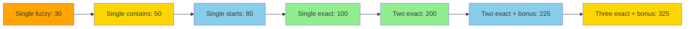

---

*Document Version: 2.0*  
*Last Updated: 2025-10-04*  
*Algorithm Location: `src/app/api/animals/route.ts`*
