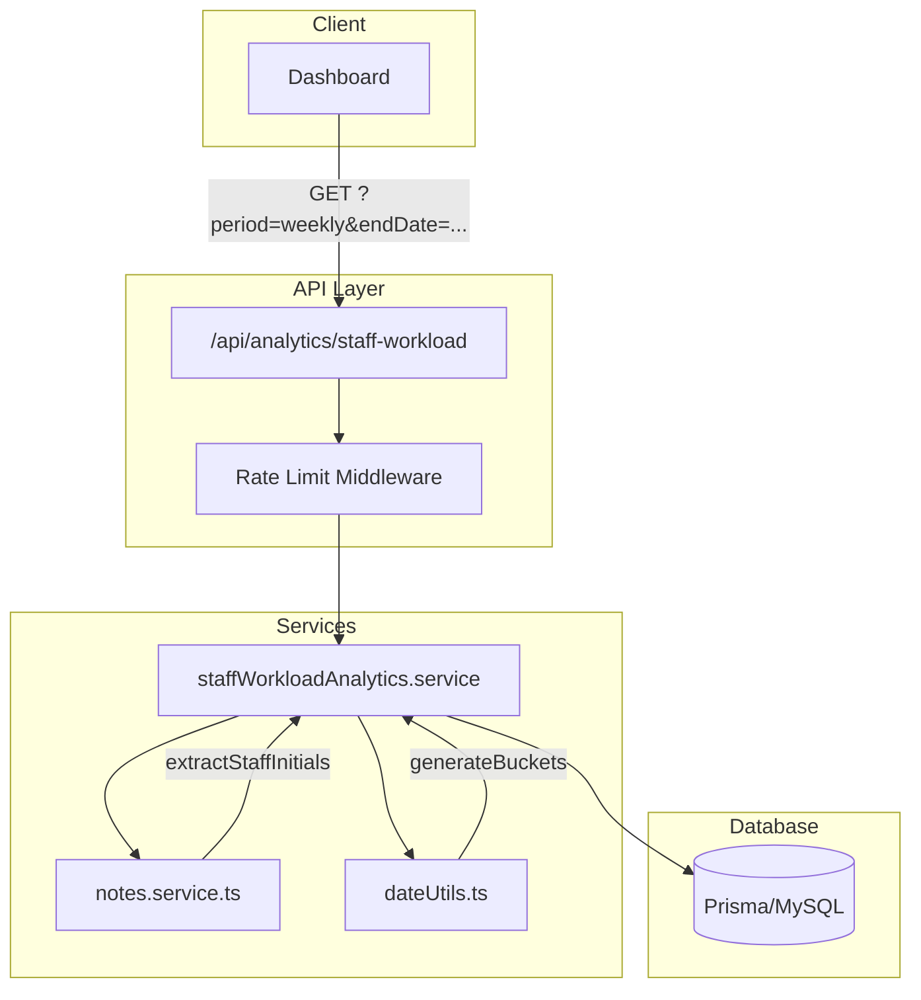

# Staff Workload Analytics Endpoint - Implementation Plan

**Specification:** [STAFF_WORKLOAD_ANALYTICS_ENDPOINT.md](file:///home/tech/projects/next-ppdb/STAFF_WORKLOAD_ANALYTICS_ENDPOINT.md)  
**Created:** 2025-12-11

---

## Proposed Changes

This implementation follows the phased approach defined in the specification (§8.2).

### Phase 1: Core Implementation (Daily + Weekly)

---

#### [NEW] [staffWorkloadAnalytics.service.ts](file:///home/tech/projects/next-ppdb/src/services/staffWorkloadAnalytics.service.ts)

New service to handle multi-period aggregation logic:

- `calculateBuckets(period, endDate)` - Generate bucket date ranges
- `aggregateStaffWorkload(startDate, endDate)` - Query and aggregate visit units
- `assignToBuckets(visitUnits, buckets)` - Distribute visit units into buckets
- Timezone handling using `Australia/Adelaide`
- Reuses [extractStaffInitials()](file:///home/tech/projects/next-ppdb/src/services/notes.service.ts#34-91) from [notes.service.ts](file:///home/tech/projects/next-ppdb/src/services/notes.service.ts)

---

#### [NEW] [route.ts](file:///home/tech/projects/next-ppdb/src/app/api/analytics/staff-workload/route.ts)

New API endpoint at `GET /api/analytics/staff-workload`:

- Zod schema validation for `period` and `endDate` query parameters
- Error responses per specification §6 (400/429/500)
- Rate limiting via [withRateLimit()](file:///home/tech/projects/next-ppdb/src/lib/middleware/rateLimit.ts#65-108) middleware
- Delegates aggregation to service layer

---

#### [MODIFY] [ratelimit.ts](file:///home/tech/projects/next-ppdb/src/lib/ratelimit.ts)

Add new rate limit type for analytics:

```diff
const RATE_LIMITS = {
  api: { points: rateLimits.api, duration: 60 },
  search: { points: rateLimits.search, duration: 60 },
  mutation: { points: rateLimits.mutation, duration: 60 },
+ analytics: { points: 30, duration: 60 },  // 30 req/min for analytics
} as const
```

---

#### [MODIFY] [config.ts](file:///home/tech/projects/next-ppdb/src/lib/config.ts)

Add analytics rate limit configuration:

```diff
export const rateLimits = {
  api: Number(process.env.RATE_LIMIT_API) || 30,
  search: Number(process.env.RATE_LIMIT_SEARCH) || 20,
  mutation: Number(process.env.RATE_LIMIT_MUTATION) || 10,
+ analytics: Number(process.env.RATE_LIMIT_ANALYTICS) || 30,
}
```

---

#### [NEW] [dateUtils.ts](file:///home/tech/projects/next-ppdb/src/lib/dateUtils.ts)

Date utility functions for bucket calculations:

- `parseDateInAdelaide(dateString)` - Parse ISO date as Adelaide local
- `formatDateISO(date)` - Format date as `YYYY-MM-DD`
- `generateDailyBuckets(endDate)` - 7 daily buckets
- `generateWeeklyBuckets(endDate)` - 8 weekly buckets (7-day increments)
- `generateMonthlyBuckets(endDate)` - 6 monthly buckets
- `generateYearlyBuckets(endDate)` - 3 yearly buckets
- `getBucketKey(period, bucketIndex, startDate)` - Generate stable bucket identifiers
- `getBucketLabel(period, startDate, endDate)` - Generate display labels

---

#### [NEW] [staffWorkloadAnalytics.service.test.ts](file:///home/tech/projects/next-ppdb/src/__tests__/services/staffWorkloadAnalytics.service.test.ts)

Unit tests for the analytics service:

- Bucket generation for all four periods
- Edge cases: leap years, month boundaries, year boundaries
- Empty data handling (buckets should be omitted)
- Staff sorting within buckets
- Visit unit deduplication (same animal/staff/date)

---

#### [NEW] [dateUtils.test.ts](file:///home/tech/projects/next-ppdb/src/__tests__/lib/dateUtils.test.ts)

Unit tests for date utilities:

- Adelaide timezone parsing
- DST transition handling
- Weekly bucket calculation (backward from endDate)
- Bucket key and label generation

---

### Phase 2: Monthly View (Future)

> [!NOTE]
> Phase 2 adds the monthly view with query optimization. Not included in initial implementation.

- Add monthly aggregation to service
- Optimize database query with selective field loading
- Consider adding composite index on [(thisvisit, date)](file:///home/tech/projects/next-ppdb/src/app/api/reports/analytics/route.ts#19-263)

---

### Phase 3: Yearly View + Caching (Future)

> [!WARNING]
> Phase 3 requires Redis caching for yearly queries. Not included in initial implementation.

- Implement Redis caching layer
- Add yearly aggregation
- Cache invalidation on note creation

---

## Summary of New/Modified Files

| File                                                                              | Action | Description                       |
| --------------------------------------------------------------------------------- | ------ | --------------------------------- |
| `src/services/staffWorkloadAnalytics.service.ts`                                  | NEW    | Multi-period aggregation service  |
| `src/app/api/analytics/staff-workload/route.ts`                                   | NEW    | API endpoint handler              |
| `src/lib/dateUtils.ts`                                                            | NEW    | Date bucket calculation utilities |
| [src/lib/ratelimit.ts](file:///home/tech/projects/next-ppdb/src/lib/ratelimit.ts) | MODIFY | Add analytics rate limit type     |
| [src/lib/config.ts](file:///home/tech/projects/next-ppdb/src/lib/config.ts)       | MODIFY | Add analytics rate limit config   |
| `src/__tests__/services/staffWorkloadAnalytics.service.test.ts`                   | NEW    | Service unit tests                |
| `src/__tests__/lib/dateUtils.test.ts`                                             | NEW    | Date utilities unit tests         |

---

## Verification Plan

### Automated Tests

```bash
# Run all new tests
pnpm test -- --testPathPattern="staffWorkloadAnalytics|dateUtils"

# Type checking
pnpm type-check

# Lint
pnpm lint
```

### Manual Verification

1. **Daily View**: `GET /api/analytics/staff-workload?period=daily&endDate=2025-12-11`
   - Verify 7 buckets returned (or fewer if empty)
   - Verify staff sorted by `totalAnimals` descending
   - Verify empty buckets omitted

2. **Weekly View**: `GET /api/analytics/staff-workload?period=weekly&endDate=2025-12-11`
   - Verify up to 8 buckets spanning 56 days
   - Verify bucket boundaries are 7-day increments from endDate

3. **Error Cases**:
   - Missing `period` → 400 with `MISSING_PARAMETER`
   - Invalid `endDate` format → 400 with `INVALID_DATE_FORMAT`
   - Invalid `period` value → 400 with `INVALID_PERIOD`

4. **Rate Limiting**:
   - Verify 429 response after exceeding limit
   - Verify `X-RateLimit-*` headers present

---

## Architecture Diagram



---

## Dependencies

- **Existing**: [notes.service.ts](file:///home/tech/projects/next-ppdb/src/services/notes.service.ts), `prisma`, `zod`, rate limit middleware
- **New**: `date-fns` or `luxon` for timezone-aware date handling (optional, can use native)

---

## Risks & Mitigations

| Risk                                 | Mitigation                                      |
| ------------------------------------ | ----------------------------------------------- |
| Weekly bucket calculation complexity | Thorough unit tests for edge cases              |
| Timezone handling bugs               | Use established patterns from Adelaide timezone |
| Performance on larger datasets       | Phase 1 limits to daily/weekly (max 56 days)    |
