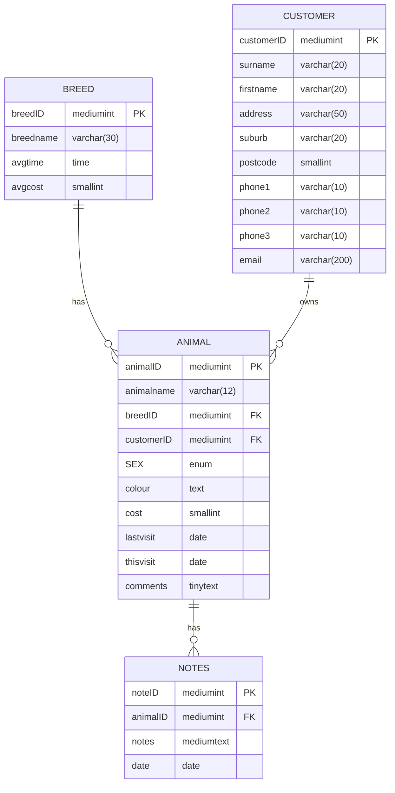

# Database

## Database Design

```mermaid
erDiagram
ANIMAL {
    animalID mediumint PK
    animalname varchar(12)
    breedID mediumint FK
    customerID mediumint FK
    SEX enum
    colour text
    cost smallint
    lastvisit date
    thisvisit date
    comments tinytext
  }
  BREED {
    breedID mediumint PK
    breedname varchar(30)
    avgtime time
    avgcost smallint
  }
  CUSTOMER {
    customerID mediumint PK
    surname varchar(20)
    firstname varchar(20)
    address varchar(50)
    suburb varchar(20)
    postcode smallint
    phone1 varchar(10)
    phone2 varchar(10)
    phone3 varchar(10)
    email varchar(200)
  }
  NOTES {
    noteID mediumint PK
    animalID mediumint FK
    notes mediumtext
    date date
  }
  BREED ||--o{ ANIMAL : "has"
  CUSTOMER ||--o{ ANIMAL : "owns"
  ANIMAL ||--o{ NOTES : "has"


```
