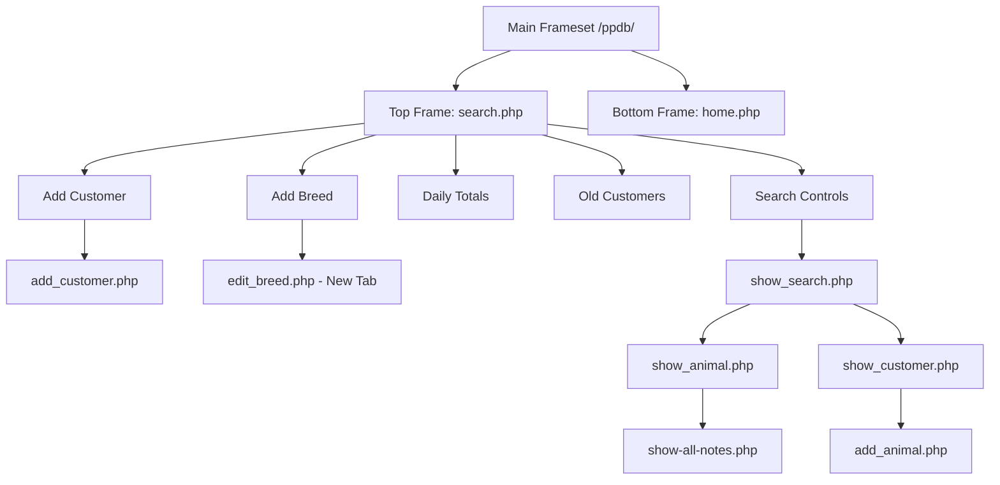
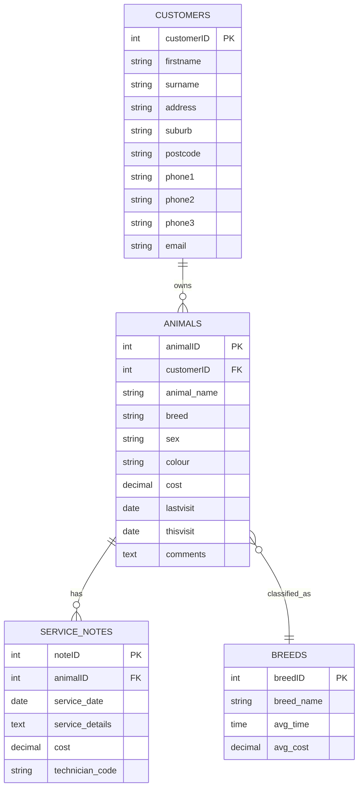
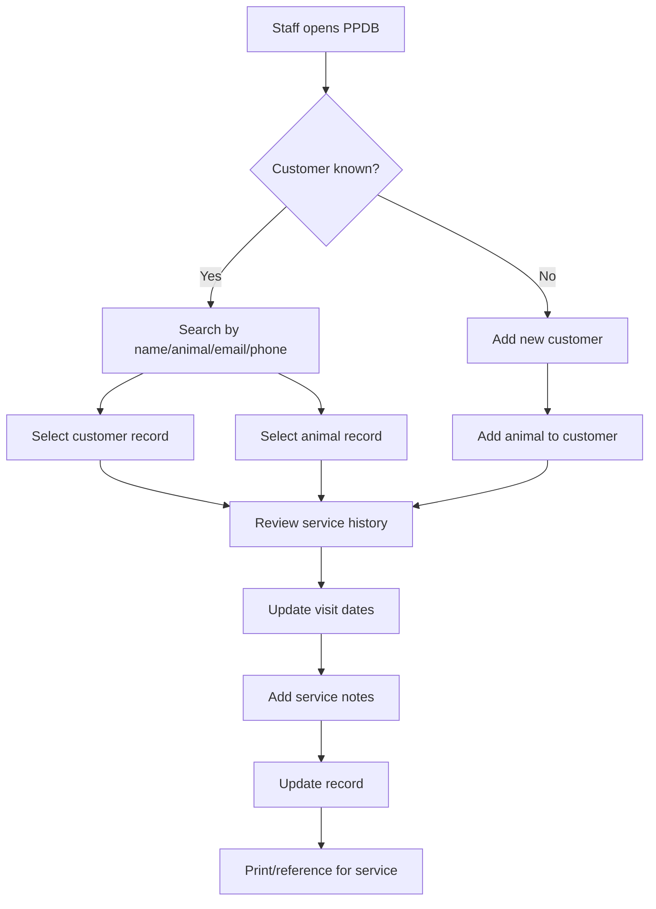
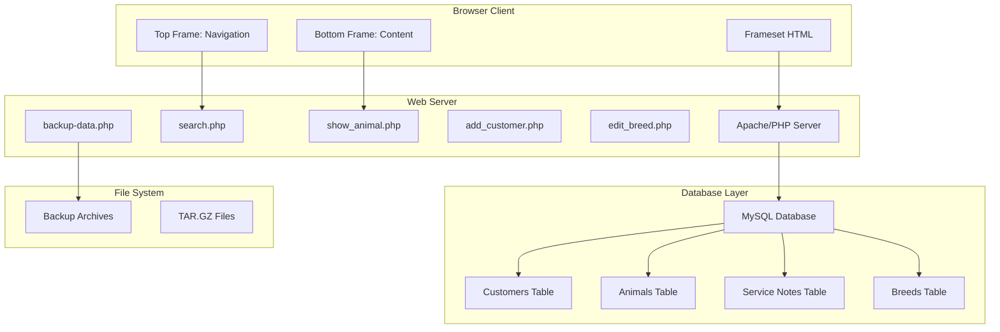
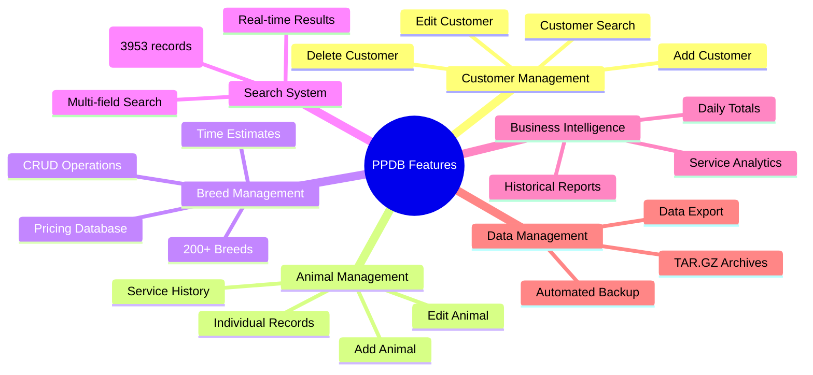
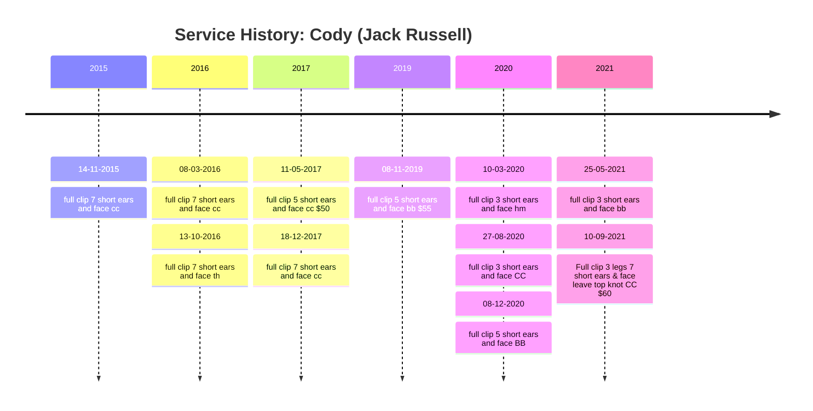
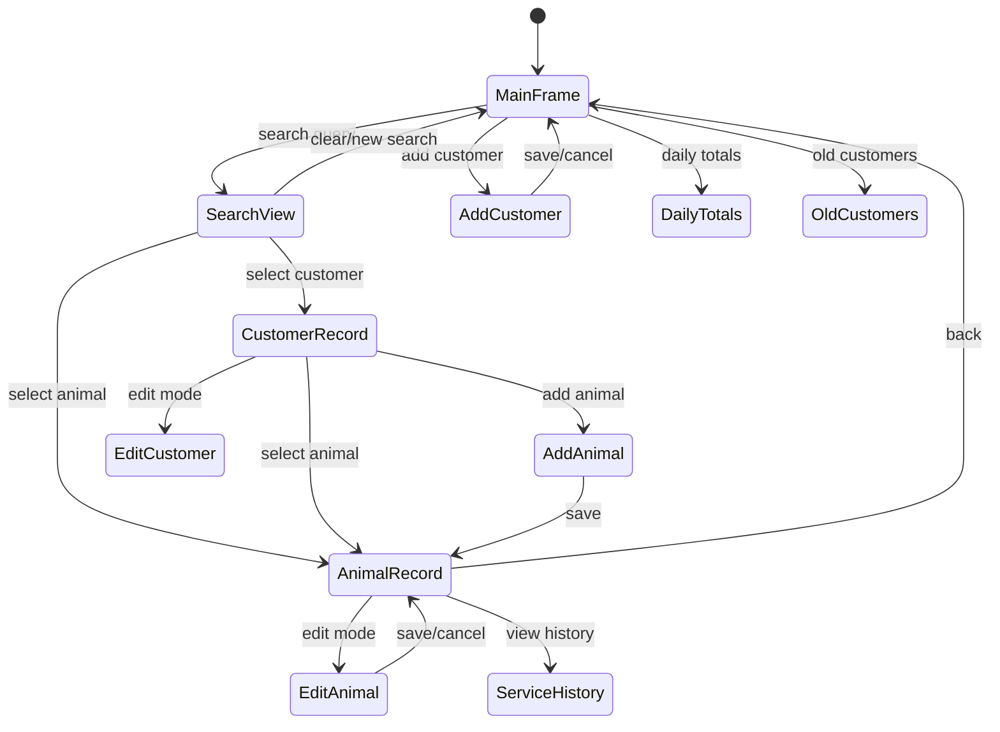
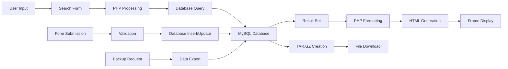
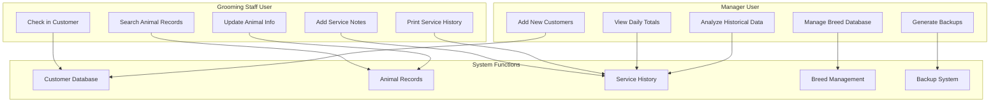

# PPDB App diagrams

## 🗺️ **1. Site Map / Navigation Flow Diagram**

**Best for**: Showing the frameset structure and page relationships

## 🗄️ **2. Entity Relationship Diagram (ERD)**

**Best for**: Database structure and relationships

## 🔄 **3. User Journey / Workflow Diagrams**

**Best for**: Business processes and user interactions

## 🏗️ **4. System Architecture Diagram**

**Best for**: Technical components and technology stack

## 📊 **5. Feature Hierarchy Mind Map**

**Best for**: Organizing and understanding feature scope

## ⏱️ **6. Service History Timeline**

**Best for**: Showing chronological service records

## 🔄 **7. State Diagram**

**Best for**: Application states and transitions

## 📈 **8. Data Flow Diagram**

**Best for**: How data moves through the system

## 🎯 **9. Use Case Diagram**

**Best for**: Different user scenarios and system interactions

## 🏆 **Most Valuable Diagrams for This Legacy System:**

### **Essential (Must-Have):**

1. **Site Map** - Critical for understanding frameset navigation
2. **ERD** - Essential for database structure comprehension
3. **User Journey** - Key for operational workflow understanding

### **Highly Valuable:**

4. **System Architecture** - Important for technical understanding
5. **Feature Mind Map** - Excellent overview of system capabilities
6. **Service Timeline** - Shows real business data patterns

### **Specialized Use:**

7. **State Diagram** - Useful for developers/modernization
8. **Data Flow** - Technical documentation
9. **Use Case** - Business process documentation

These diagrams would be particularly effective because they can show the **complexity hidden behind the simple interface**, demonstrate the **sophisticated business logic**, and illustrate the **mature data relationships** that make this legacy system so valuable to the business.
